# Test report

## Latest: Phase 4, knowledge base

Run on 30 September 2026 against a freshly reset Docker stack (`down -v`, rebuild, `pnpm sample:load`), branch `feat/phase-4-kb`.

**Result: every step of the gate passed.**

| Step                | Result                                                 |
| ------------------- | ------------------------------------------------------ |
| `pnpm format:check` | pass                                                   |
| `pnpm lint`         | pass                                                   |
| `pnpm build`        | pass                                                   |
| `pnpm typecheck`    | pass                                                   |
| `pnpm test`         | 96 passed                                              |
| `pnpm test:int`     | 60 passed                                              |
| `pnpm e2e`          | 33 passed; 5 screenshot-only specs skipped as designed |
| `pnpm kb:eval`      | recall@5 = 1.00 (18 of 18 labelled questions)          |

The check steps ran through `scripts/check-in-docker.sh` as before. `pnpm e2e` ran natively with `CHROMIUM_PATH`.

### New tests

| Where                                           | Tests | Covers                                                                                                                                                                                                                                                                                                                                                                                                                                        |
| ----------------------------------------------- | ----: | --------------------------------------------------------------------------------------------------------------------------------------------------------------------------------------------------------------------------------------------------------------------------------------------------------------------------------------------------------------------------------------------------------------------------------------------- |
| `apps/api/src/kb/kb.test.ts`                    |    13 | Heading trails and chunk sizes with overlap; sentence splitting; file-type detection; HTML headings kept and navigation dropped; PDF text without page markers; private, loopback and metadata addresses refused; rank fusion; section trails without the title; snippets                                                                                                                                                                     |
| `apps/orbit-desk/src/features/kb/logic.test.ts` |     4 | Index state labels, review actions per status, quoting a result with its source, file sizes                                                                                                                                                                                                                                                                                                                                                   |
| `apps/api/test/kb.int.test.ts`                  |     7 | Upload a generated PDF → indexed → not searchable as a draft → approved and found with vector and keyword matches and a file citation. Customer audience sees public documents only; team documents only for members. A new version replaces the old chunks. Keyword fallback without an embedding model. Unsafe URLs, unsupported files and non-managers refused. Audit rows and chunk deletion. Recall@5 ≥ 0.8 on the sample knowledge base |
| `e2e/tests/kb.spec.ts`                          |     5 | Agent search with citations (no drafts, no management); supervisor adds, indexes and approves an FAQ entry; an uploaded Markdown file takes its title from its heading; the ticket drawer inserts a cited answer into the reply; no horizontal scroll at 390px                                                                                                                                                                                |

### Bugs found and fixed

1. **Indexing jobs never ran.** BullMQ rejects job ids containing `:`, and the error only showed in worker logs.
   - **Fix:** ids use `--` as the separator.
   - **Tooling:** `TEST_LOG_LEVEL` now surfaces worker logs in integration tests, and `RUN=...` runs a single test file in the container.
2. **Embeddings came back as 256 numbers instead of 1024.** The `openai` SDK asks for base64 embeddings by default and decoded the float arrays wrongly.
   - **Fix:** the client asks for `encoding_format: 'float'`, and the fake provider handles both formats.
3. **Keyword search found almost nothing for questions.** `websearch_to_tsquery` requires every word.
   - **Fix:** keyword matching ORs the meaningful words and ranks with `ts_rank_cd`.
4. **Uploads without a title were named after the file** ("returns-policy").
   - **Fix:** indexing replaces the file name with the document's first heading or HTML title.
5. **Section trails repeated the document title**, and the top bar said "Overview" on the knowledge base page. Both fixed, and covered by the unit test and the screenshot below.

### Screenshot

Knowledge base search and documents:

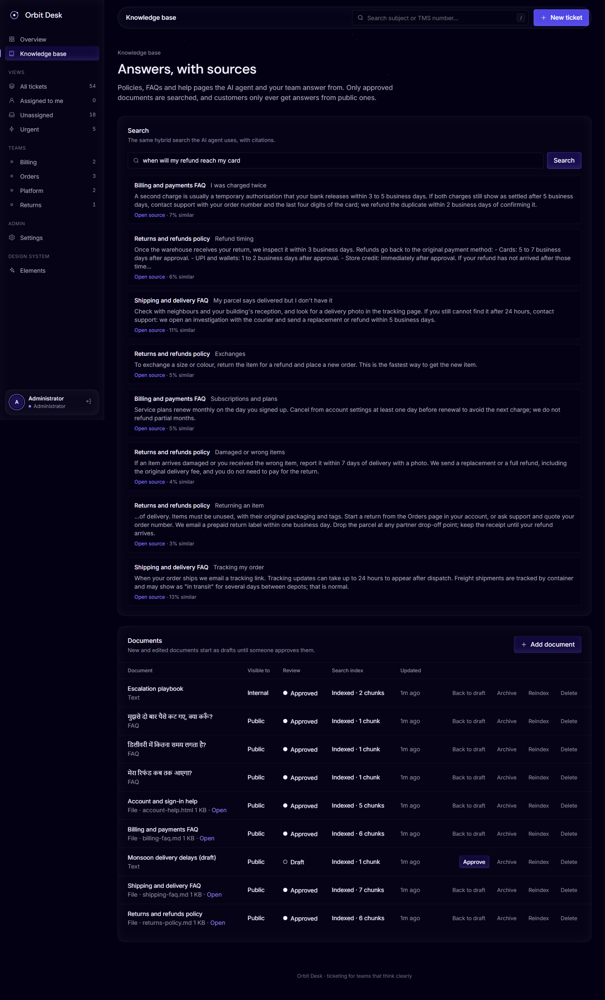

---

## Phase 3: LLM platform and Settings keys

Run on 30 September 2026 against a freshly reset Docker stack (`down -v`, rebuild, `pnpm sample:load`), branch `feat/phase-3-llm-settings`.

**Result: every step of the gate passed.**

| Step                | Result                                                 |
| ------------------- | ------------------------------------------------------ |
| `pnpm format:check` | pass                                                   |
| `pnpm lint`         | pass                                                   |
| `pnpm build`        | pass                                                   |
| `pnpm typecheck`    | pass                                                   |
| `pnpm test`         | 79 passed                                              |
| `pnpm test:int`     | 53 passed                                              |
| `pnpm e2e`          | 28 passed; 4 screenshot-only specs skipped as designed |

### How it was run

- The check steps ran through `bash scripts/check-in-docker.sh`: a Node 22 Linux container on the compose network, the same as the CI `check` job.
  - On this Windows host, `@swc/core` refuses to load because its cache folder under `AppData\Local` inherits permissions it treats as unsafe.
- `pnpm e2e` ran natively against the Docker stack, with `CHROMIUM_PATH` pointing at an installed Chromium.
- LiteLLM and `fake-providers` were part of the stack. The integration tests register real providers and models in LiteLLM, pointing at the scripted fake LLM.

### New tests

| Where                                                 | Tests | Covers                                                                                                                                                                                                                                                                                                   |
| ----------------------------------------------------- | ----: | -------------------------------------------------------------------------------------------------------------------------------------------------------------------------------------------------------------------------------------------------------------------------------------------------------- |
| `apps/api/src/llm/llm-router.test.ts`                 |     9 | Cheapest-first ordering by blended price, unknown prices last, cap skipping (including a $0 cap), capability filtering, disabled providers and models, fixed order, allowlists, pinned embeddings, warnings                                                                                              |
| `apps/api/src/settings/secret-crypto.test.ts`         |     7 | AES-GCM round trip, fresh IVs, tamper detection, key-name binding, wrong master key, masking                                                                                                                                                                                                             |
| `apps/fake-providers/src/llm.test.ts`                 |     4 | Scripted replies and deterministic embeddings                                                                                                                                                                                                                                                            |
| `apps/orbit-desk/src/features/settings/logic.test.ts` |     7 | Tabs by permission, money and price formatting, masking, budget parsing, reordering                                                                                                                                                                                                                      |
| `apps/api/test/settings.int.test.ts`                  |    15 | 401/403 for agents and supervisors; secrets encrypted, never echoed or audited in clear, rotated and deleted with audit rows; channel validation and test results; providers through LiteLLM; routing, caps, fallback after a scripted failure, "over budget" error, fixed order, key rotation, deletion |
| `e2e/tests/settings.spec.ts`                          |     5 | The demo provider is masked and tests "Connected"; add a provider and a model in the UI, and cheapest-first routing picks it; a channel secret is stored write-only; hidden from agents and team leads (403); no horizontal scroll at 390px                                                              |

### Bugs found and fixed

1. **Integration run failed on unhandled Redis errors.** All 38 tests passed on `main`, but vitest reported 24 unhandled rejections, so the run exited 1.
   - **Cause:** `RedisIoAdapter.close()` runs once per Socket.IO namespace, and the second call quit connections that were already closed.
   - **Fix:** the adapter quits its clients once, and ignores expected shutdown errors.
2. **Orbit Desk Settings widened the page at 390px by 83px.**
   - **Cause:** visually-hidden table header labels are absolutely positioned. Their containing block was the card, outside the table's scroll box, so they escaped its clipping. A grid item with `min-width: auto` made it worse.
   - **Fix:** the scroll box is `position: relative`, and grid children get `min-width: 0`.
   - **Guard:** the phone-width spec in `settings.spec.ts`.
3. **The sample loader raced LiteLLM on a fresh stack.** LiteLLM runs its own migrations on first start and had no healthcheck.
   - **Fix:** compose has a LiteLLM healthcheck, and the loader waits until `/health/ready` reports LiteLLM up.
4. **Integration tests couldn't reach LiteLLM through Turbo.** Turbo strips undeclared environment variables.
   - **Fix:** `TEST_LITELLM_URL`, `TEST_LITELLM_MASTER_KEY` and `TEST_FAKE_LLM_URL` are declared in `turbo.json`.

### Screenshots

Settings, AI providers:

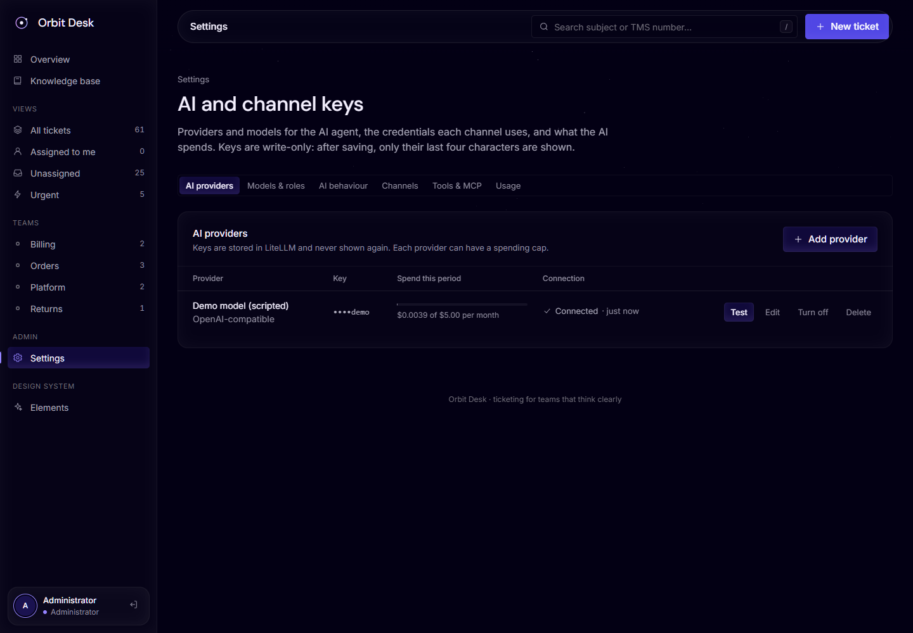

Settings, models and roles:

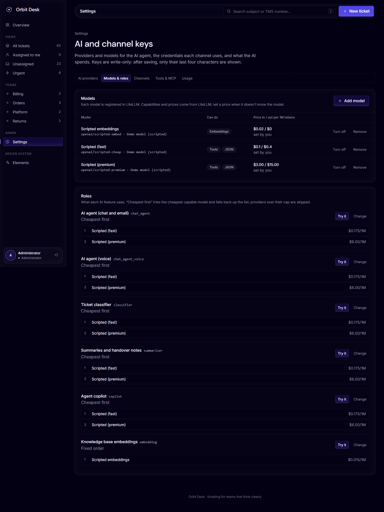

---

## Earlier: consolidated main

Run on 30 September 2026, 11:46–11:48 UTC, against a freshly reset Docker stack.

**Result: 113 of 113 tests passed.** That covers 52 unit and component tests, 38 API integration tests and 23 browser end-to-end tests. Three screenshot-only specs were skipped in the main run and run separately to capture the images below.

### What was tested

`main` now combines both earlier Claude branches:

| Branch                         | What it brought                                                                                    |
| ------------------------------ | -------------------------------------------------------------------------------------------------- |
| `claude/pensive-planck-yp2tyi` | Full stack: NestJS API and worker, Postgres/Drizzle, basic console, chat widget, email channel, CI |
| `claude/gifted-clarke-yl2r34`  | Orbit Desk dashboard (`apps/orbit-desk`). It used mock data before and is now wired to the API     |

Changes made on top of the merge:

- **Reports endpoint.** Added `GET /api/v1/reports/overview`, which feeds the dashboard's tiles, chart, queue health, team load and activity feed.
- **Orbit Desk on real data.** It now signs in, reads and writes real data, and updates live over the `/agent` socket.
- **Sample data loader.** `pnpm sample:load` fills the stack with fictional records.
- **E2E suite and CI.** Added a Playwright suite in `e2e/` and an `e2e` job in CI.

### Environment

| Piece          | Detail                                                                                                        |
| -------------- | ------------------------------------------------------------------------------------------------------------- |
| Stack          | `infra/docker-compose.yml`, profile `app`: api, worker, migrate, web (:8080), orbit-desk (:8081)              |
| Infrastructure | Postgres 16 (pgvector image), Redis 7, SeaweedFS (S3), GreenMail (support mailbox), Mailpit (outbound mail)   |
| Images         | Built from the root `Dockerfile`, with base images pulled via `mirror.gcr.io` because Docker Hub returned 429 |
| Browser        | Chromium through Playwright 1.56.1, 1440×1000 viewport (390×844 for the phone test)                           |
| Runtime        | Node 22, pnpm 9.15                                                                                            |
| Not started    | LiteLLM. Its phase (Phase 3) hasn't begun, so `/health/ready` reports it as `down` as expected                |

### Sample data (fictional, written for this run)

The loader lives in `scripts/sample-data/`. Every person and company is invented, and all email domains use the reserved `example.*` TLDs.

| Data         | Contents                                                                                                                                                                   |
| ------------ | -------------------------------------------------------------------------------------------------------------------------------------------------------------------------- |
| Teams        | 4: Orders, Billing, Returns, Platform                                                                                                                                      |
| Users        | 7: one team lead, one supervisor, five agents. Password `Sample-Passw0rd!`                                                                                                 |
| Customers    | 25: 13 standard, 8 business, 3 VIP, 1 internal. Company stored in attributes; 4 have WhatsApp identities, some have phones                                                 |
| Tickets      | 40 scripted. **Status:** 8 new, 1 AI handling, 2 human assigned, 6 in progress, 4 pending, 14 resolved, 5 closed                                                           |
|              | **Priority:** 4 urgent, 6 high, 20 normal, 10 low. **Channel:** 25 email, 7 web chat, 4 WhatsApp, 3 phone, 1 agent                                                         |
| Activity     | 6 internal notes and 6 agent email replies (delivered to Mailpit)                                                                                                          |
| Live traffic | 3 web chats sent through the widget socket and 3 customer emails sent over SMTP to the support mailbox. Each became a ticket, and an agent answered one chat and one email |
| History      | Ticket timestamps spread over 14 days, so the chart and medians have shape                                                                                                 |

The loader finished in about 20 seconds. A second run correctly stopped with the message "already loaded".

Dashboard figures after the full test run, which adds its own tickets on top of the sample data:

- **Counts:** 36 open tickets, 19 unassigned, 10 resolved in 7 days.
- **Medians:** 5h 30m to resolution, 40m to first response.
- **Open tickets by channel:** 18 email, 10 web chat, 3 WhatsApp, 3 phone, 2 agent.
- **Mailpit:** 10 outgoing messages.

### Results

#### Unit and component tests (`pnpm test`): 52 passed

| Package           | Tests | Covers                                                                                                                                                                                  |
| ----------------- | ----: | --------------------------------------------------------------------------------------------------------------------------------------------------------------------------------------- |
| `@tms/shared`     |    11 | Workflow defaults, ticket numbers, identity normalisation, roles, report helpers (`median`, `lastDays`)                                                                                 |
| `@tms/api`        |    14 | Email parsing and threading, workflow rules                                                                                                                                             |
| `@tms/orbit-desk` |    27 | API adapters, status glyphs, allowed transitions, thread merging, queue ordering, triage, KPIs, activity text, chart scale, and components: queue table, new ticket form, ticket drawer |

#### API integration tests (`pnpm test:int`, real Postgres, Redis, S3 and GreenMail): 38 passed

| File                       | Tests | Covers                                                                                                                |
| -------------------------- | ----: | --------------------------------------------------------------------------------------------------------------------- |
| `api.int.test.ts`          |    23 | Health, auth, RBAC, customers, tickets, workflow, notes, history, audit                                               |
| `chat.int.test.ts`         |     5 | Widget sessions, visitor to ticket, live agent reply, rate limit                                                      |
| `email.int.test.ts`        |     3 | Email to ticket, threaded replies both ways, reopen on answer, auto-reply filtering                                   |
| `outbox-relay.int.test.ts` |     4 | Outbox relay and delivery                                                                                             |
| `reports.int.test.ts`      |     3 | New endpoint: permission gate (401/403/200), exact deltas after create/assign/resolve, customer fields on ticket rows |

#### End-to-end tests (`pnpm e2e`, Playwright against the Docker stack): 23 passed

Every test also fails if the browser logs an unexpected console error.

| #   | Area                | Test                                                                                             | Result |
| --- | ------------------- | ------------------------------------------------------------------------------------------------ | ------ |
| 1   | Auth: Orbit Desk    | Wrong password shows "Email or password is incorrect"                                            | Pass   |
| 2   | Auth: Orbit Desk    | Sign in, session survives reload, sign out                                                       | Pass   |
| 3   | Auth: basic console | Wrong password rejected, then sign in and out                                                    | Pass   |
| 4   | Web chat            | Visitor message in the widget becomes a ticket without a reload; agent reply reaches the visitor | Pass   |
| 5   | Email               | Customer email over SMTP becomes a ticket; drawer reply arrives in Mailpit tagged `[TMS-n]`      | Pass   |
| 6   | Basic console       | List, search and open a ticket                                                                   | Pass   |
| 7   | Basic console       | Reply on an email conversation                                                                   | Pass   |
| 8   | Basic console       | Customer search and customer page                                                                | Pass   |
| 9   | Dashboard           | KPI tiles, queue health, team load and activity match `/reports/overview`                        | Pass   |
| 10  | Dashboard           | Sidebar view counts and rows match API queries (all, unassigned, urgent)                         | Pass   |
| 11  | Dashboard           | "Assigned to me" as a team lead shows only that user's tickets                                   | Pass   |
| 12  | Dashboard           | Search by subject and by `TMS-n`, empty state and clear, status tabs                             | Pass   |
| 13  | Dashboard           | Clicking an activity entry opens that ticket                                                     | Pass   |
| 14  | Dashboard           | A ticket created through the API appears live                                                    | Pass   |
| 15  | Ticket drawer       | Details, and only the workflow-allowed transitions are offered                                   | Pass   |
| 16  | Ticket drawer       | Note, status, priority and assignee changes; API state and queue row agree                       | Pass   |
| 17  | Ticket drawer       | Reply is delivered (pending, then sent) and emailed to the customer                              | Pass   |
| 18  | New ticket          | Existing customer found by search; saved with priority, channel and tags                         | Pass   |
| 19  | New ticket          | New customer created inline                                                                      | Pass   |
| 20  | New ticket          | API validation error shown for an invalid email                                                  | Pass   |
| 21  | RBAC                | Agent sees the queue but no reports, gets 403 from `/reports/overview`, and can't reassign       | Pass   |
| 22  | RBAC                | API refuses assignment by an agent (403)                                                         | Pass   |
| 23  | Phone width (390px) | No horizontal scroll on first paint or after load; menu drawer opens; drawer fits the screen     | Pass   |

### Bugs found and fixed while testing live

1. **Orbit Desk: horizontal scroll on phones while the dashboard loads.**
   - **Cause:** the volume chart rendered 640px wide until its ResizeObserver fired, adding 286px of horizontal scroll at 390px.
   - **Origin:** the bug was already on the Orbit Desk branch; mock data loaded instantly and hid it.
   - **Fix:** the chart is now measured before first paint.
   - **Guard:** E2E test 23.
2. **Orbit Desk: long subjects widened the queue table**, which pushed the Channel column out of view at 1440px.
   - **Fix:** the ticket cell now ellipsizes.
   - **How it was found:** only real, longer subjects exposed it.
3. **Merge: two Vite versions broke the API typecheck.** Orbit Desk's Vite 8 / Vitest 5 toolchain changed how dependencies resolved, which broke the API typecheck.
   - **Fix:** Orbit Desk now uses the same Vite 6 / Vitest 3 as the rest of the repo.
4. **Docker builds failed on the Docker Hub rate limit (HTTP 429).**
   - **Fix:** the `Dockerfile` now takes `NODE_IMAGE` and `NGINX_IMAGE` build args, so a mirror can be used. This is documented in the README.

A few first-run failures came from the tests themselves: the wrong error wording, a duplicate text match and a float rounding. Those tests were corrected, and the app was not changed for them.

### Known limits

- **No SLA or CSAT figures.** The backend has no data for them until the SLA phase, so Orbit Desk no longer shows invented numbers. The "SLA at risk" view is gone for the same reason.
- **Day boundaries are UTC.** The volume chart groups days in UTC.
- **Queue lists are capped.** A view shows at most 200 rows, the API page limit, and says so when capped.
- **Tests leave data behind.** The E2E tests create their own tickets and can be re-run on the same data, but each run adds records. Reset with `docker compose -f infra/docker-compose.yml --profile app down -v`.

### Reproduce

```bash
pnpm install
pnpm docker:up                     # or build with the mirror args if Docker Hub rate-limits you
pnpm sample:load
pnpm test                          # unit and component tests
docker compose -f infra/docker-compose.yml exec postgres createdb -U tms tms_test
pnpm test:int                      # integration tests
pnpm --filter @tms/e2e exec playwright install chromium
pnpm e2e                           # E2E; HTML report in e2e/playwright-report
SCREENSHOTS=1 pnpm --filter @tms/e2e e2e tests/screenshots.spec.ts   # refresh the images below
```

### Screenshots

Orbit Desk dashboard on sample data:

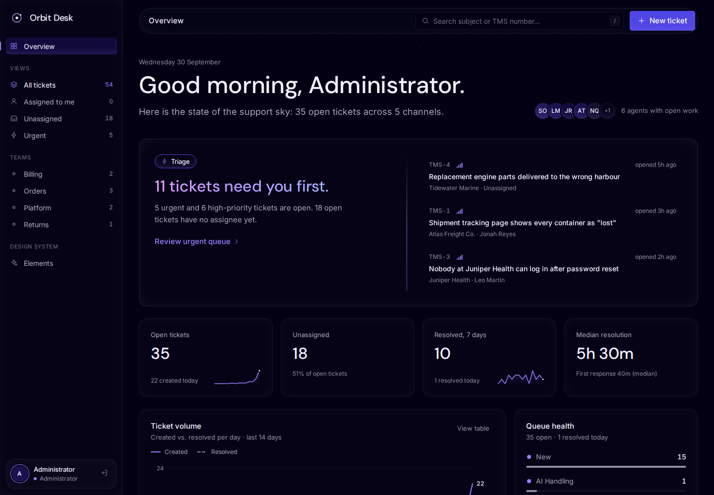

Queue:

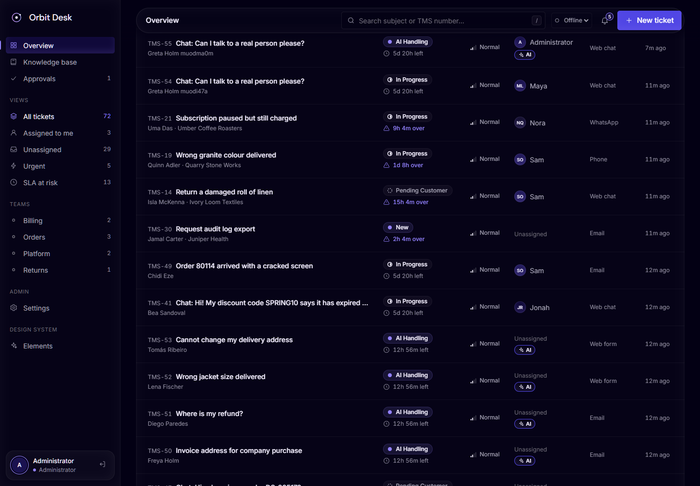

Ticket drawer with notes and a delivered email reply:

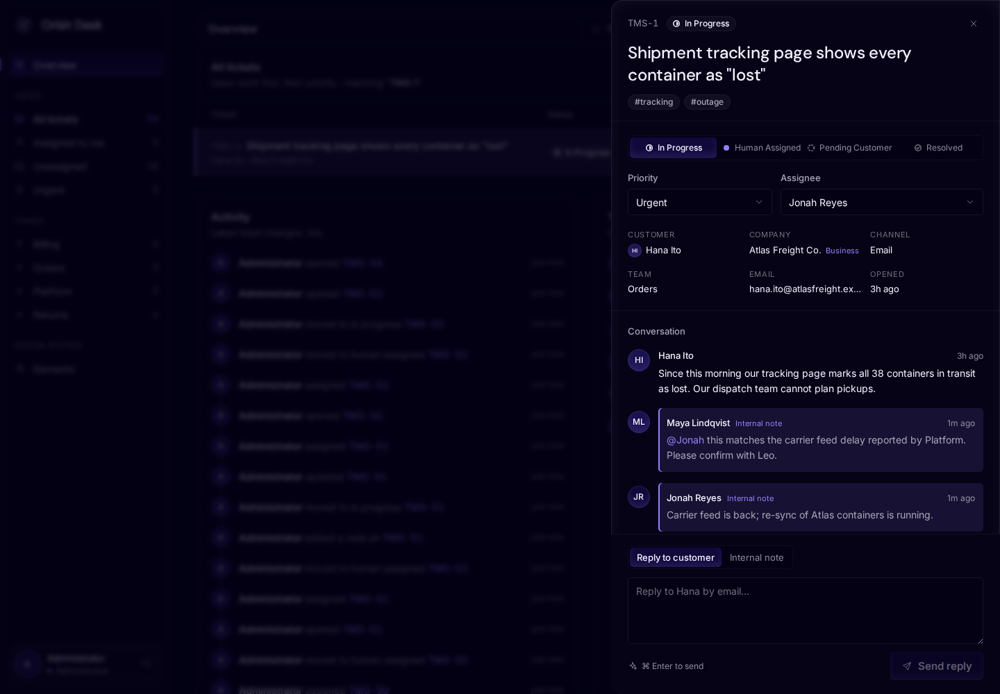

New ticket, with customer search:

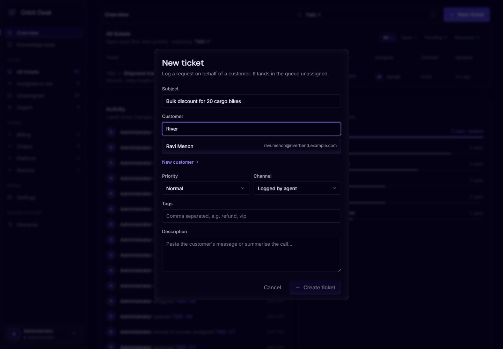

Phone width:

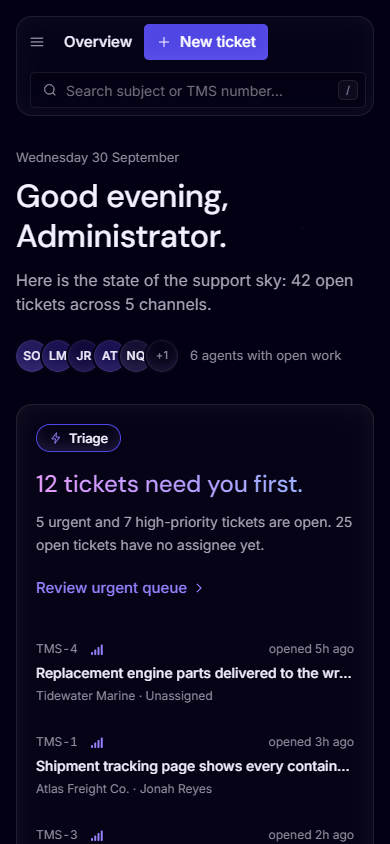

Basic console ticket page:

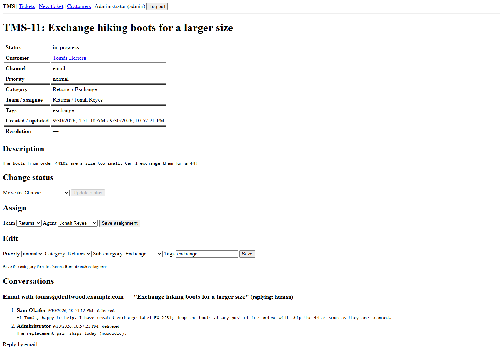

Chat widget on the demo store page:

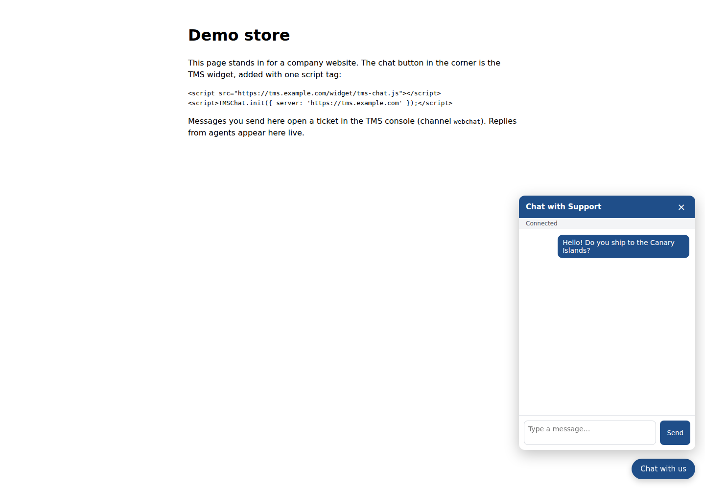

Outgoing replies in Mailpit:

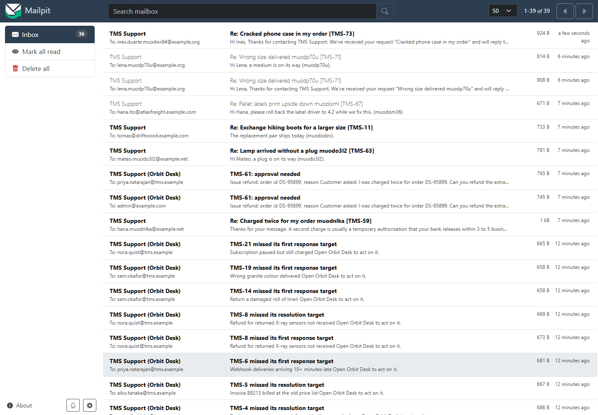
