# Test report

## Latest: Phase 9, voice calls in the browser

Run on 1 October 2026 against a freshly reset Docker stack (`down -v`, rebuild, `pnpm sample:load`), branch `feat/phase-9-voice`.

**Result: every step of the gate passed. Voice has not been run against Sarvam itself** (see below).

| Step                                              | Result                                                                           |
| ------------------------------------------------- | -------------------------------------------------------------------------------- |
| `pnpm format:check`, `lint`, `build`, `typecheck` | pass                                                                             |
| `pnpm test`                                       | 279 passed (api 160, Orbit Desk 76, shared 23, fake providers 15, help center 5) |
| `pnpm test:int`                                   | 170 passed (16 files)                                                            |
| `pnpm e2e`                                        | 68 passed; 9 screenshot-only specs skipped as designed                           |
| `pnpm kb:eval`                                    | recall@5 = 1.00 (18 of 18)                                                       |
| `pnpm ai:eval`                                    | 9 of 9 golden conversations passed                                               |

### What was and wasn't tested

There is no stand-in for Sarvam, and no Sarvam key on the test stack.

- **Tested:** everything on our side of the speech provider. The Sarvam client talks to a WebSocket server created inside its unit test, using the message formats from Sarvam's documentation. Whole calls run through the real `/voice` and `/agent` sockets, the AI agent, handover, recording and retention, with speech scripted by the test (it says what was heard, and records what was spoken).
- **Not tested:** a call with real audio. No speech has been recognised or spoken by Sarvam, and nobody has heard a call. The browser microphone and playback code has unit tests for its maths only.
- **First things to check with a real key:** that Sarvam accepts `linear16` output at 16 kHz on the streaming speech socket (its guide lists it; its API reference mentions MP3 only), and how the delay before the AI starts speaking feels.

### Sample data

Unchanged. The three sample tickets with channel "Voice call" are tickets an agent logged after a phone call; they have no transcript or recording, because none were made.

### New tests

| Where                                               |   Tests | Covers                                                                                                                                                                                                                                                                                                                                                                                                                                |
| --------------------------------------------------- | ------: | ------------------------------------------------------------------------------------------------------------------------------------------------------------------------------------------------------------------------------------------------------------------------------------------------------------------------------------------------------------------------------------------------------------------------------------- |
| `apps/api/src/channels/voice/voice.test.ts`         |      20 | WAV building and reading, sentence chunks, the stereo recorder (alignment, cut on interruption, size limit), the voice rule "no drafts on a call", the call state machine (greeting, a turn, English when the language has no voice, barge-in, waiting for a person, an agent joining, the time limit, a failed answer, ending once), the Sarvam client (messages sent, transcripts, speech signals, audio out, abort, a refused key) |
| `apps/api/src/channels/health/health-rules.test.ts` | updated | The Voice light follows the key, the last connection test and the free lines                                                                                                                                                                                                                                                                                                                                                          |
| `apps/orbit-desk/.../voice/voice.test.ts`           |       5 | Call summary lines, who answered, downsampling 48 kHz to 16 kHz, 100 ms frames, playback samples, loudness                                                                                                                                                                                                                                                                                                                            |
| `apps/api/test/voice.int.test.ts`                   |       9 | See below                                                                                                                                                                                                                                                                                                                                                                                                                             |
| `e2e/tests/voice.spec.ts`                           |       5 | See below                                                                                                                                                                                                                                                                                                                                                                                                                             |

`voice.int.test.ts` covers:

- **Before setup:** a caller is told calls are not available; a start without accepting the recording notice is refused.
- **A call answered by the AI:** greeting, a question answered from the knowledge base and spoken, a ticket with channel `voice`, the transcript with AI messages stored as sent, audit entries, the call record, and a stereo recording in S3.
- **Language:** a Hindi caller is answered in Hindi.
- **Barge-in:** speech stops and the caller's page is told to drop queued audio.
- **Handover:** "talk to a real person" plays the hold line and hands the ticket over. An agent joins; a second agent is refused; a typed reply is refused; audio flows both ways; both sides are transcribed; the AI stays quiet. Agents can't play the recording, supervisors can, and listening is audited.
- **Retention:** recordings older than 30 days are deleted and the transcript stays.
- **Endings:** closing the page ends the call; a call where nobody spoke leaves no ticket.
- **Refusals:** every line busy, and a speech provider that refuses the key.
- **Status:** the Voice light and its lines in channel status.

`voice.spec.ts` covers:

- The call page shows the recording notice, and Start call answers "Voice calls are not available right now" without opening the microphone.
- The chat demo links to the call page.
- An admin saves the voice settings; the light turns red with "Sarvam key: Not saved. Calls cannot start."
- Agents are refused recordings.
- The call page fits a phone screen.

### Bugs found and fixed

1. **A typed reply on a voice call was accepted** and stored as sent, although the caller could never see it. It is now refused with "Join the call to talk to the caller", and the ticket offers only an internal note.
2. **The greeting field showed the first few words only.** It is now a text area across the form.
3. **A settings test counted audit entries made by other test files** and failed once the voice tests also saved a Sarvam key. It now counts what its own step adds.

### Known limits

- Not yet run against Sarvam (above).
- Live calls are held in one API process: with several instances an agent can only join a call on the instance their socket reached, and a restart ends its calls.
- The AI's reply is spoken after the whole turn finishes, not word by word.
- Browser calls only. Real phone numbers are not built.

### Screenshots

The call page (`/widget/voice.html`):

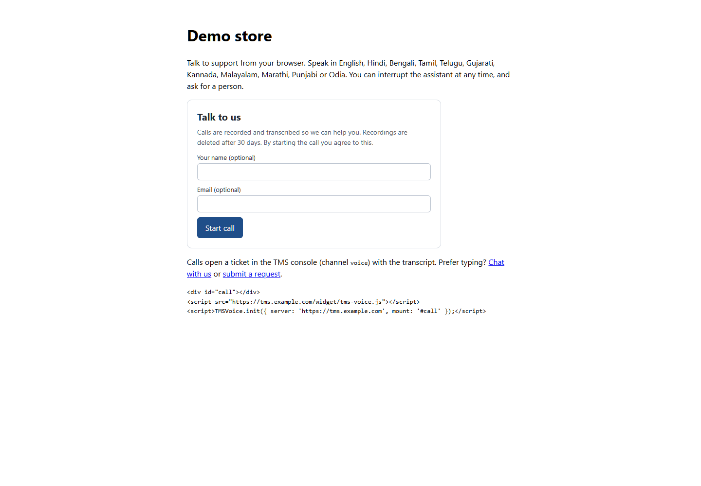

On a phone:

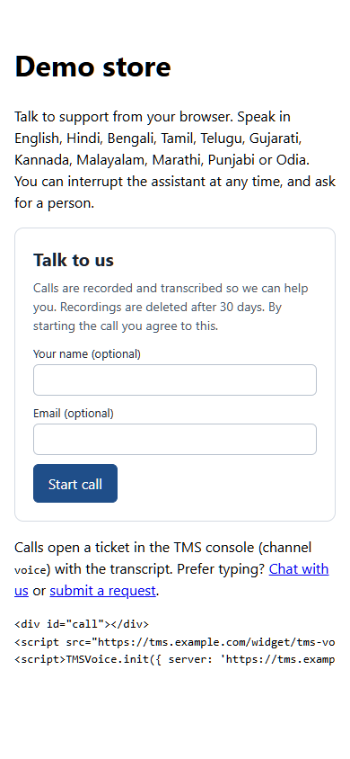

Voice settings, switched on without a key:

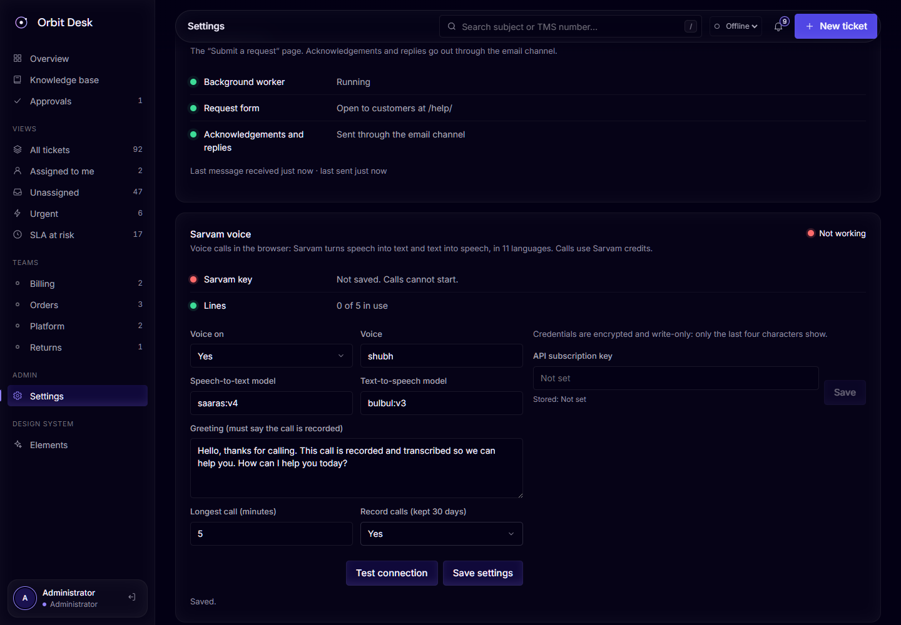

---

## Phase 8c: custom tools and custom MCP servers

Run on 1 October 2026 against a freshly reset Docker stack (`down -v`, rebuild, `pnpm sample:load`), branch `feat/phase-8c-custom-tools`.

**Result: every step of the gate passed.**

| Step                                              | Result                                                                           |
| ------------------------------------------------- | -------------------------------------------------------------------------------- |
| `pnpm format:check`, `lint`, `build`, `typecheck` | pass                                                                             |
| `pnpm test`                                       | 254 passed (api 140, Orbit Desk 71, shared 23, fake providers 15, help center 5) |
| `pnpm test:int`                                   | 161 passed (15 files)                                                            |
| `pnpm e2e`                                        | 63 passed; 9 screenshot-only specs skipped as designed                           |
| `pnpm kb:eval`                                    | recall@5 = 1.00 (18 of 18)                                                       |
| `pnpm ai:eval`                                    | 9 of 9 golden conversations passed                                               |

### How custom tools and custom MCP servers were tested

The integration test starts its own "company systems" inside the test: a small HTTP API and an MCP server written with the MCP SDK. Nothing in it uses the bundled Demo Store sample, so it shows that any HTTP API and any streamable-HTTP MCP server work, not only ours.

### Sample data

One custom tool is added: "Store systems status", a GET to the sample server's health address.

### New tests

| Where                                        | Tests | Covers                                                                                                                                                                                           |
| -------------------------------------------- | ----: | ------------------------------------------------------------------------------------------------------------------------------------------------------------------------------------------------ |
| `apps/api/src/tools/http-tool.test.ts`       |    13 | Building the request (placeholders escaped, query or JSON body, key header), answers (JSON, text, empty, 4xx, 5xx, 429), no redirects, private addresses, definition rules, the generated schema |
| `apps/orbit-desk/.../tools/logic.test.ts`    |    +3 | The custom tool form round trip                                                                                                                                                                  |
| `apps/orbit-desk/.../settings/logic.test.ts` |    +1 | The Tools tab for someone who may only create custom tools                                                                                                                                       |
| `apps/api/test/custom-tools.int.test.ts`     |    14 | See below                                                                                                                                                                                        |
| `e2e/tests/custom-tools.spec.ts`             |     4 | See below                                                                                                                                                                                        |

`custom-tools.int.test.ts` covers:

- **Permission:** agents, team leads and supervisors are refused until an admin grants `tool:create`. A granted team lead can create tools but still can't see MCP servers or set keys. Revoking stops it. Only delegable permissions can be granted, and the administrator role can't be changed. Grants are audited.
- **Definitions:** metadata and private addresses, undeclared placeholders, bad names and duplicate names are refused.
- **Calls:** a new tool starts off; a test call sends the key, the escaped path value and the query; missing or unexpected arguments are refused before any request; a 404 is reported as the system's answer; POST sends a JSON body; a redirect is not followed.
- **Outages:** after repeated 503s the tool is paused without another request, and other custom tools keep working.
- **Lifecycle:** edit and switch on keep the name; an unused tool can be deleted; a used one can't; the holder of custom tools can't be removed as a server.
- **The AI:** it answers "Where is my order?" from a custom tool, with the customer's email filled in by TMS, not by the model. A transactional custom tool waits for a supervisor, and runs only after approval.
- **A custom MCP server:** added with an `X-Api-Key` key; a sync without the key fails and the reason is kept; with the key its tools arrive switched off, with tier and customer argument guessed from the server's hints; a call returns its result; a tool error and invalid arguments are reported; an unreachable server records why the sync failed.

`custom-tools.spec.ts` covers:

- An admin creates a tool in the dialog (an internal address and a missing value are refused with reasons), tests it, switches it on, edits it, and is told a used tool can only be switched off.
- A team lead is refused until the admin ticks the role. The lead then sees one Settings tab with custom tools only, creates a tool, and still can't reach keys or MCP servers. Unticking removes access.
- An admin adds a second MCP server through the form: sync fails without the key, then succeeds, tools arrive switched off, and a test call returns the order.
- The dialog fits a phone screen.

### Bugs found and fixed

1. **Every Settings dialog had no padding and could not scroll** (providers, models, routing rules, SLA, tool tests, handover reasons). Content sat flush against the edge, and a tall form was cut off. Found on the new tool dialog; fixed once in the shared dialog component.
2. **Checkbox labels in Models and SLA settings were laid out as rows with a top border.** The Phase 8b status lights reused the class name `check`. The lights now use their own class.
3. **The role checkbox did not react until the server answered.** It now changes at once.

### Known limits

- A custom tool is one request: no pagination, no response mapping, no extra headers besides the key.
- A role with `tool:create` can make the AI send customer data to any public address that role chooses. Grant it with that in mind.
- A grant can take up to ten seconds to reach other API instances.

### Screenshots

Custom tools in Settings → Tools & MCP:

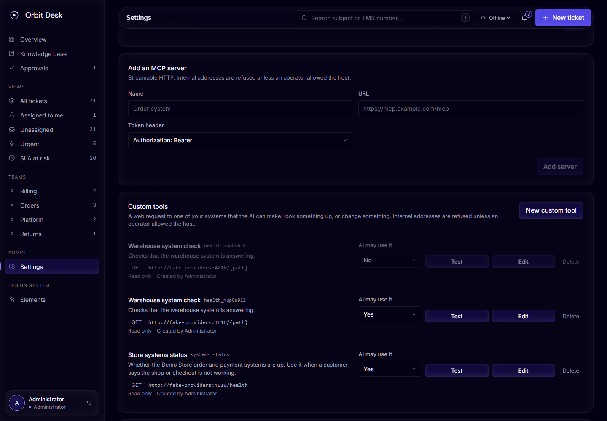

The new custom tool dialog:

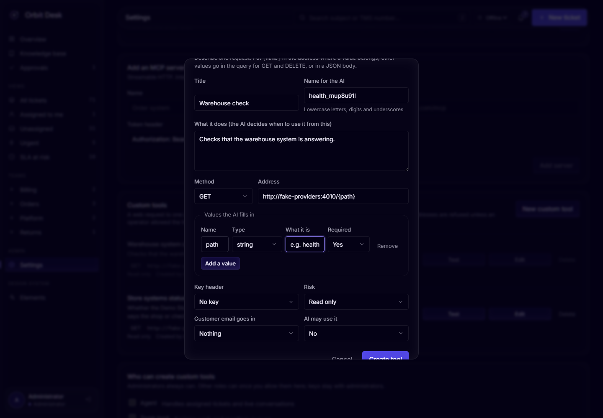

Who can create custom tools:

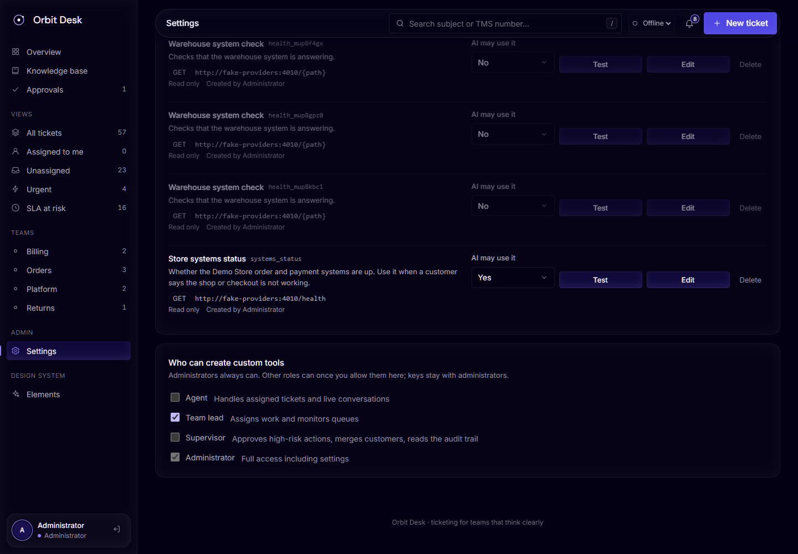

---

## Phase 8b: channel status lights and one-step WhatsApp connect

Run on 1 October 2026 against a freshly reset Docker stack (`down -v`, rebuild, `pnpm sample:load`), branch `feat/phase-8b-channel-health`.

**Result: every step of the gate passed.**

| Step                                              | Result                                                                           |
| ------------------------------------------------- | -------------------------------------------------------------------------------- |
| `pnpm format:check`, `lint`, `build`, `typecheck` | pass                                                                             |
| `pnpm test`                                       | 237 passed (api 127, Orbit Desk 67, shared 23, fake providers 15, help center 5) |
| `pnpm test:int`                                   | 147 passed (14 files)                                                            |
| `pnpm e2e`                                        | 59 passed; 9 screenshot-only specs skipped as designed                           |
| `pnpm kb:eval`                                    | recall@5 = 1.00 (18 of 18)                                                       |
| `pnpm ai:eval`                                    | 9 of 9 golden conversations passed                                               |

### What was and wasn't tested

- **Tested for real:** the email light against GreenMail (reading and sending, and a refused SMTP login), web chat and the help-center form, the worker check, the monitor and its notification, and every screen.
- **Answered inside the test process:** Meta's replies during the connect flow and the WhatsApp checks, as in Phase 8.
- **Not tested:** a green WhatsApp light against Meta's servers. That needs a Meta app.

### What the sample stack shows

Settings → Channels on the Docker stack: email, web chat and the help-center form are green; WhatsApp and voice are grey (off). The sample data is unchanged.

### New tests

| Where                                                  | Tests | Covers                                                                                                       |
| ------------------------------------------------------ | ----: | ------------------------------------------------------------------------------------------------------------ |
| `apps/api/src/channels/health/health-rules.test.ts`    |    17 | Every rule behind the lights, for each channel: green, amber, red and grey, and the sentence shown for each  |
| `packages/shared/src/channel-health.test.ts`           |     5 | Worst-check state, labels, the connect form's validation                                                     |
| `apps/orbit-desk/.../settings/channel-health.test.tsx` |     8 | Overview wording, the light always saying its state in words, tiles, check lists, the verify-token generator |
| `apps/api/test/channel-health.int.test.ts`             |    13 | See below                                                                                                    |
| `e2e/tests/channel-health.spec.ts`                     |     4 | See below                                                                                                    |

`channel-health.int.test.ts` covers:

- **Access:** the lights and the connect form are refused for agents and for anonymous calls.
- **All channels:** five lights; web chat green with the worker running; voice off.
- **Email:** green once the mailbox is watched and the mail server answers. With a wrong SMTP port it turns red, names sending as the failing half while reading stays green, and the help-center form turns red with it.
- **Connect WhatsApp:**
  - invalid IDs and a missing token are refused before Meta is called;
  - a rejected token saves nothing and explains why;
  - a number that is not under the business account saves nothing and lists the numbers Meta does see;
  - a good form connects: it checks, saves, subscribes, and no key appears in any response;
  - the light is amber until Meta verifies or calls the webhook, then green;
  - reconnecting without keys keeps the saved ones; a PIN registers the number; a wrong PIN is reported without undoing the connection.
- **Monitor:** when Meta stops accepting the token the light turns red and admins get one notification; agents get none; a second failed check sends nothing more.
- **Subscription:** the light is red when Meta sends the account's messages to no app.
- **Off and missing token:** grey when switched off, red when the token is removed.

`channel-health.spec.ts` covers:

- The overview shows five lights; after **Check now** email and web chat are working, WhatsApp is off, and the email card explains each check. A tile scrolls to its card.
- The Connect WhatsApp form asks for the token and rejects a phone number typed as an ID, without calling Meta. **Generate** fills a 48-character verify token and shows it.
- Agents are refused by the API.
- The page fits a phone screen.

`whatsapp.spec.ts` now also checks the red light and its reason when WhatsApp is switched on without a token.

### Bugs found and fixed

1. **Tiles that jumped to a channel's card left the Settings page.** They were links to `#channel-card-…`, and Orbit Desk uses the address after `#` as its route. They are now buttons that scroll. Found by the browser test.
2. **A test locator matched two rows**, because the "Deliveries" reason also contained the words "access token". The tests now match a check by its exact label.

### Known limits

- A light can be up to five minutes old between checks; **Check now** refreshes it.
- A green WhatsApp light proves the token, the number and the subscription. Only a call from Meta proves the webhook address is right, which is why the light stays amber until Meta has called once.
- The web chat visitor count is for one API instance.
- Voice shows grey until Phase 9.

### Screenshots

Channel status, with the email card's checks:

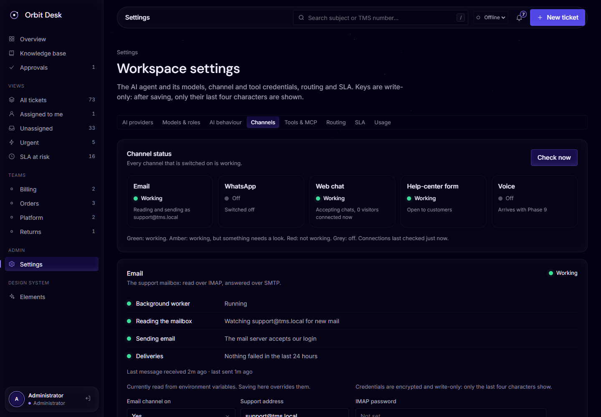

The Connect WhatsApp form. The API has just rejected a phone number typed as an ID:

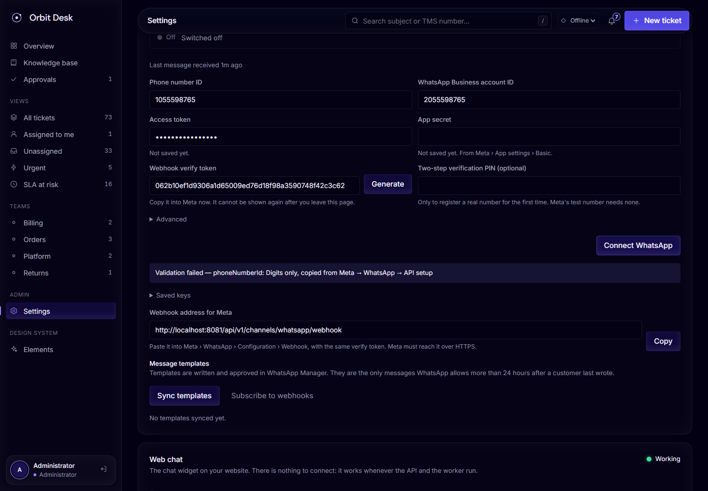

WhatsApp switched on without an access token: a red light and the reason:

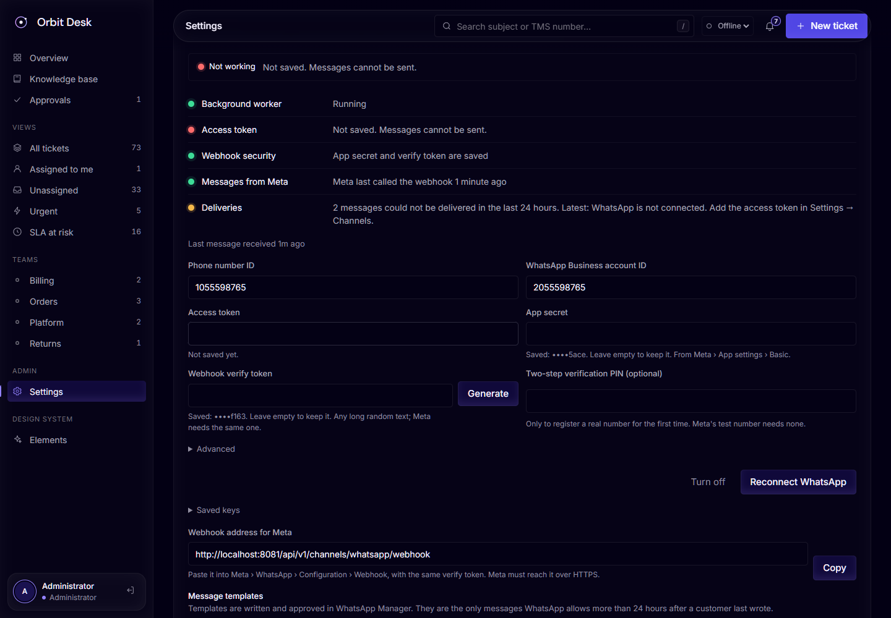

Channel status at phone width:

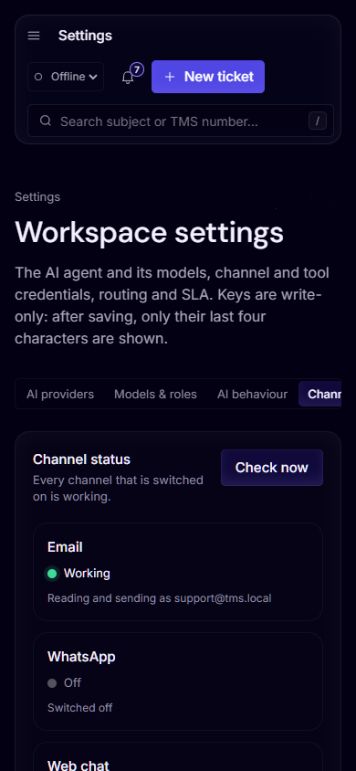

---

## Phase 8: WhatsApp

Run on 1 October 2026 against a freshly reset Docker stack (`down -v`, rebuild, `pnpm sample:load`), branch `feat/phase-8-whatsapp`.

**Result: every step of the gate passed.**

| Step                                              | Result                                                                           |
| ------------------------------------------------- | -------------------------------------------------------------------------------- |
| `pnpm format:check`, `lint`, `build`, `typecheck` | pass                                                                             |
| `pnpm test`                                       | 209 passed (api 110, Orbit Desk 61, shared 18, fake providers 15, help center 5) |
| `pnpm test:int`                                   | 134 passed (13 files)                                                            |
| `pnpm e2e`                                        | 55 passed; 9 screenshot-only specs skipped as designed                           |
| `pnpm kb:eval`                                    | recall@5 = 1.00 (18 of 18)                                                       |
| `pnpm ai:eval`                                    | 9 of 9 golden conversations passed                                               |

### What was and wasn't tested

There is no Meta app yet, and by decision there is no simulator or fake Graph API (ADR 0015). So:

- **Tested for real:** the public webhook route, signature and handshake checks, the queue, the worker, tickets and customers, media into object storage, the sender's request to Meta, delivery reports, the 24-hour rule, templates, and every screen.
- **Answered inside the test process:** calls to `graph.facebook.com` in the integration tests. The code under test is the real client; only Meta's replies are supplied by the test.
- **Not tested:** a round trip with Meta's servers. That needs a Meta app and a public HTTPS address (`docs/runbooks/phase-8-demo.md`).

### Sample data

Unchanged. The four sample WhatsApp tickets are still tickets with the WhatsApp label and no conversation. Sample WhatsApp conversations would need either Meta credentials or pretend deliveries, and the channel is off until someone connects a real number.

### New tests

| Where                                             | Tests | Covers                                                                                                                                                                                                                                                                                          |
| ------------------------------------------------- | ----: | ----------------------------------------------------------------------------------------------------------------------------------------------------------------------------------------------------------------------------------------------------------------------------------------------- |
| `apps/api/src/channels/whatsapp/whatsapp.test.ts` |    41 | The ported code: phone and identity helpers, signature and verify-token checks, Graph requests (phone or user-id recipient, templates, error envelope, media host and size limits, template paging), error explanations and retry decisions, template components, webhook parsing, status order |
| `packages/shared/src/whatsapp.test.ts`            |     7 | 24-hour window, template variables and preview, send and start-conversation schemas                                                                                                                                                                                                             |
| `apps/orbit-desk/.../whatsapp/logic.test.ts`      |    10 | Window note, template picker fields and request, setup checklist, delivery labels                                                                                                                                                                                                               |
| `apps/api/test/whatsapp.int.test.ts`              |    21 | See below                                                                                                                                                                                                                                                                                       |
| `e2e/tests/whatsapp.spec.ts`                      |     4 | See below                                                                                                                                                                                                                                                                                       |

`whatsapp.int.test.ts` covers:

- **Before setup:** the handshake and every delivery are refused, including one signed with an empty key.
- **Webhook security:** the handshake answers only for the saved verify token; unsigned, wrongly signed and tampered bodies get 401 and create nothing.
- **Connection test:** shows the number, its name and quality; a rejected token is explained.
- **Inbound:**
  - a first message opens a ticket and a customer, and the next one joins it;
  - a redelivered webhook stores nothing twice;
  - a photo is saved as a downloadable attachment;
  - a message whose file can't be fetched is still stored;
  - reactions and other phone numbers on the same app are ignored.
- **Outbound:**
  - an agent reply reaches Meta with the right address, token and body, and Meta's message id is saved;
  - reports arriving out of order (read, then delivered, then failed) leave the message read;
  - a failed report shows Meta's reason;
  - an error a retry can't fix fails after one attempt, and a temporary one is retried.
- **Username-only senders:** filed under the user id, answered with `recipient`; when Meta later shows the phone number, it is the same customer and ticket.
- **Templates and the 24-hour window:**
  - sync is admin-only, and agents see approved templates only;
  - Meta's status webhooks add and remove templates from that list;
  - free text after 24 hours gets a 409, a template with too few values gets a 400, and a complete one is sent with its components;
  - once the customer answers, free text works again;
  - an unapproved template is refused;
  - a ticket can be opened on WhatsApp with a template, and the customer's reply lands on it.
- **AI:** a WhatsApp question is answered by the AI and sent through Meta.
- **No token:** an agent's reply is refused with "not connected".

`whatsapp.spec.ts` covers:

- The webhook's handshake and a refused forged call, against the running stack.
- Settings → Channels: the webhook address, the "Still to do" list, the empty template list, and the reason a sync can't run yet.
- A customer message opens a ticket in the queue. The AI's answer shows "Not delivered" with the reason, and an agent's reply is refused with the same explanation.
- A message older than 24 hours leaves the reply box with templates only, checked at phone width.

### Bugs found and fixed

1. **A known customer writing on WhatsApp for the first time broke the inbound message.** A customer saved with a phone number has a `phone` identity. Their first WhatsApp message tried to create a second customer with the same number and hit the unique index. They are now recognised as the same person and linked. Found while testing conversations started by an agent.
2. **A refused webhook handshake answered 500 instead of 403.** The plain-text content type was set before the error was written. Found by the integration test.
3. **A message arriving just after the channel was switched on could be dropped.** The worker kept the old "off" setting for up to five seconds. WhatsApp settings are now read fresh every time.
4. **Buttons in the WhatsApp settings card were stretched** to the height of the neighbouring column. Fixed for every channel card.

### Known limits

- WhatsApp is off until a Meta app is connected, and Meta needs a public HTTPS address for the webhook.
- Agents send text and templates, not files. The AI doesn't read customers' files.
- One WhatsApp number.
- Reactions are ignored, and customers don't get read receipts.
- Templates are written in WhatsApp Manager; TMS only syncs and sends them.

### Screenshots

Settings → Channels → WhatsApp (as rebuilt in Phase 8b: switched on without an access token, so the light is red):


A WhatsApp ticket. The AI's answer could not be sent, and the reason is shown under it:

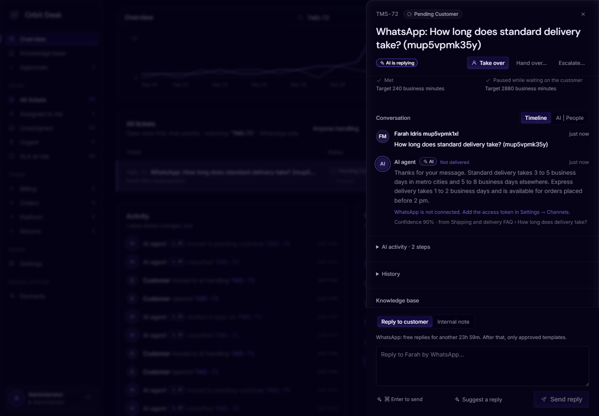

More than 24 hours after the customer's last message, at phone width:

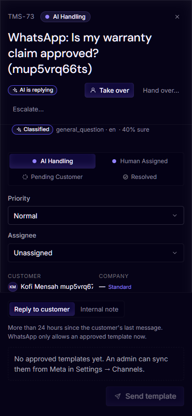

---

## Phase 7: handover, routing, SLA and notifications

Run on 30 September 2026 against a freshly reset Docker stack (`down -v`, rebuild, `pnpm sample:load`), branch `feat/phase-7-handover-sla`.

**Result: every step of the gate passed.**

| Step                                              | Result                                                                          |
| ------------------------------------------------- | ------------------------------------------------------------------------------- |
| `pnpm format:check`, `lint`, `build`, `typecheck` | pass                                                                            |
| `pnpm test`                                       | 151 passed (api 69, Orbit Desk 51, fake providers 15, shared 11, help center 5) |
| `pnpm test:int`                                   | 113 passed (12 files)                                                           |
| `pnpm e2e`                                        | 51 passed; 9 screenshot-only specs skipped as designed                          |
| `pnpm kb:eval`                                    | recall@5 = 1.00 (18 of 18)                                                      |
| `pnpm ai:eval`                                    | 9 of 9 golden conversations passed                                              |

### What the sample data shows

- **SLA states** after the loader and one sweep: 13 tickets breached (old open ones), 19 met, 14 on track, 7 paused while waiting on the customer.
- **Handover:** Nina Petrova's request for a person (TMS-46) was handed over by the AI. Routing gave it to Jonah Reyes (online, Orders team, web chat taken in turns), and the context pack was written by the model.

### New tests

| Where                                        | Tests | Covers                                                                                                                                                                     |
| -------------------------------------------- | ----: | -------------------------------------------------------------------------------------------------------------------------------------------------------------------------- |
| `apps/api/src/sla/sla.test.ts`               |     6 | Business-time maths: always open; nights, weekends and holidays; add and count agree; Berlin across the October DST change. Policy specificity; routing condition matching |
| `apps/api/src/routing/routing.test.ts`       |     3 | Least loaded; round robin; skills, exclusions, team queue, offline                                                                                                         |
| `apps/orbit-desk/.../handover/logic.test.ts` |     3 | Lanes with switch markers, who-is-replying text, SLA timer lines, history labels                                                                                           |
| `apps/orbit-desk/.../components.test.tsx`    |    +1 | Handled-by filter, SLA countdown and "Handed over" in queue rows                                                                                                           |
| `apps/api/test/sla.int.test.ts`              |     5 | See below                                                                                                                                                                  |
| `apps/api/test/handover.int.test.ts`         |     9 | See below                                                                                                                                                                  |
| `e2e/tests/handover.spec.ts`                 |     6 | See below                                                                                                                                                                  |

`sla.int.test.ts` covers:

- SLA settings are admin-only and validated (unknown time zone, backwards window).
- Hours and policies are created, and hours still in use can't be deleted.
- Timers start with the ticket; the first response is met by a reply; resolution pauses while pending and resumes when the customer writes.
- A priority change switches to the most specific policy.
- At 80% the ticket is at risk (and appears in the `sla=at_risk` list); at 100% it is breached, once. The assignee and team lead are notified, and the lead gets the breach by email.
- Reading clears the unread count.

`handover.int.test.ts` covers:

- Routing and presence permissions; rules are kept in order.
- A Hindi request for a person goes to the online agent with the "hindi" skill, who is notified. The context pack is written by the model.
- History filtered to the AI shows only AI entries.
- Round robin spreads work and skips offline agents.
- Two simultaneous take-overs give one 200 and one 409 naming the winner. The ticket is assigned to the winner and In Progress, and the AI stays quiet.
- Hand-back lets the AI answer the waiting question, and a second hand-back gets 409.
- An agent handover to another team waits in that team's queue.
- The copilot suggests a reply.
- Team leads can escalate; agents can't.
- Handling and audit actor filters.

`handover.spec.ts` covers:

- A widget visitor asks for a person: context pack, take over, reply delivered, AI | People lanes with a switch marker, hand back.
- A second person trying to take over is told who has it.
- A notification opens its ticket.
- The SLA at risk view and the drawer's timers.
- Handled-by filter and History by actor.
- Settings → Routing and SLA, and phone width.

### Bugs found and fixed

1. **The reply box could stay on "Internal note"** (found by the new browser test). The composer chose its mode on first render, before the ticket's conversations had loaded. It now switches to replying once that is possible, unless the agent already picked a mode.
2. **Take-over left the routed agent assigned.** Found while testing; the person who takes over now owns the ticket.
3. **Take-over and hand-back needed transitions the default workflow doesn't have** (AI Handling → In Progress, In Progress → AI Handling). They now step through Human Assigned, which the workflow allows.
4. **The sample loader showed 31 breached tickets instead of 13.** Its backdating set first-response and resolution times in the database without settling the timers. The loader now marks them met, or breached when late.
5. **The handover test depended on the AI tests' knowledge base.** Run alone, the AI couldn't answer. The test now seeds its own FAQ.

### Known limits

- Presence is set by hand (online, away, offline), with no automatic offline on disconnect.
- SLA states update every 30 seconds (the sweep interval).
- Notification emails go to agents' addresses through the email channel's SMTP (Mailpit in the dev stack).

### Screenshots

The queue on the SLA at risk view, with countdowns and the Handled-by filter:

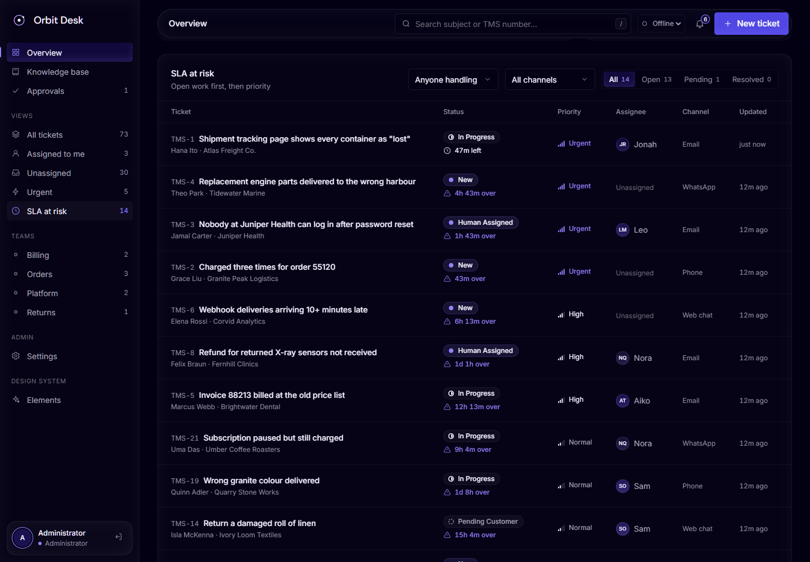

A ticket handed over by the AI, waiting for a person:

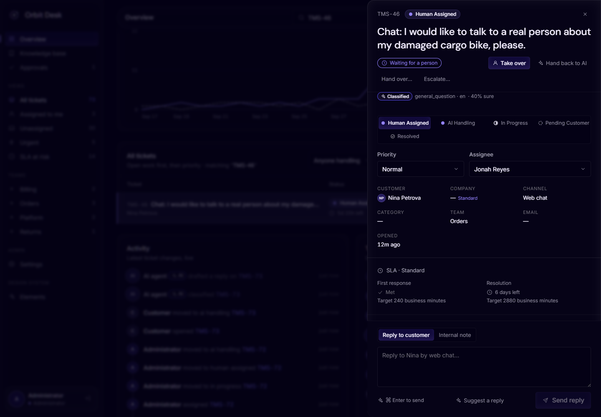

The same conversation as AI | People lanes:

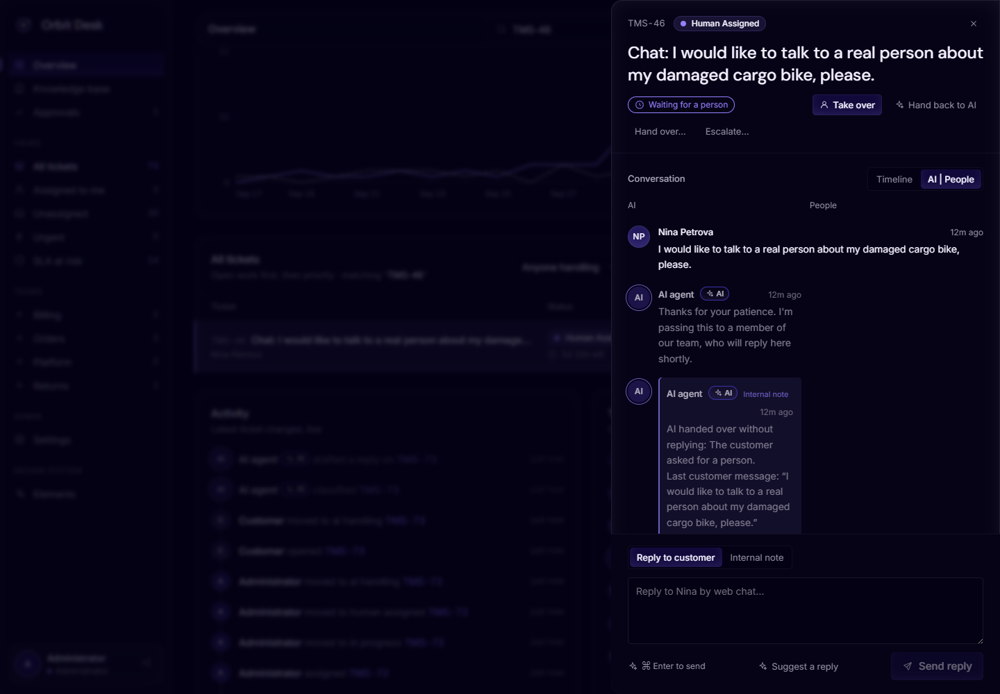

The notification bell:

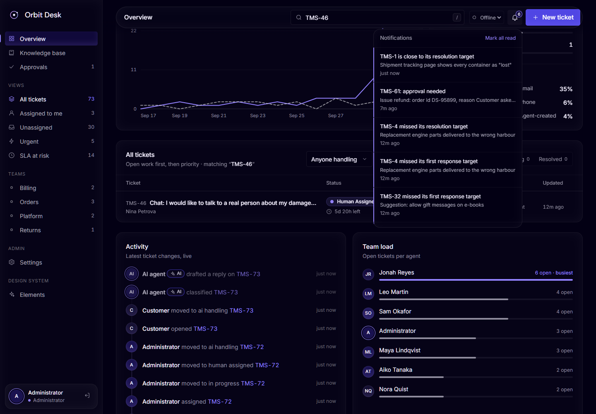

Settings → Routing and Settings → SLA:

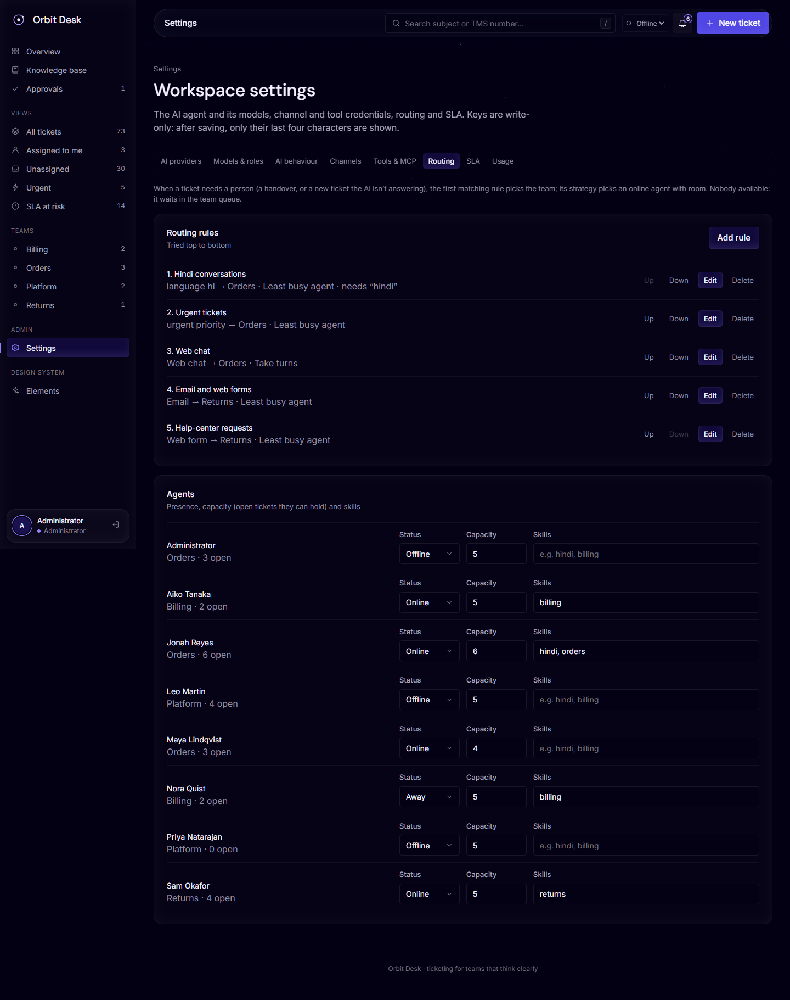

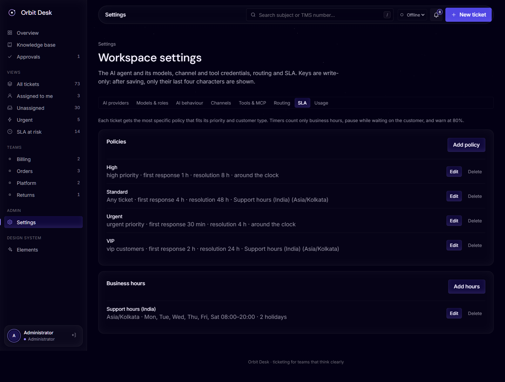

---

## Phase 6: company tools and approvals

Run on 30 September 2026 against a freshly reset Docker stack (`down -v`, rebuild, `pnpm sample:load`), branch `feat/phase-6-tools`.

**Result: every step of the gate passed.**

| Step                                              | Result                                                                          |
| ------------------------------------------------- | ------------------------------------------------------------------------------- |
| `pnpm format:check`, `lint`, `build`, `typecheck` | pass                                                                            |
| `pnpm test`                                       | 138 passed (api 60, Orbit Desk 47, fake providers 15, shared 11, help center 5) |
| `pnpm test:int`                                   | 99 passed (10 files)                                                            |
| `pnpm e2e`                                        | 45 passed; 8 screenshot-only specs skipped as designed                          |
| `pnpm kb:eval`                                    | recall@5 = 1.00 (18 of 18)                                                      |
| `pnpm ai:eval`                                    | 9 of 9 golden conversations passed (6 agent, 3 new tool goldens)                |

### What the sample data shows

- **TMS-47:** María López asks "where is my order DS-20517?". The AI calls `order_status` and answers with the carrier and tracking number. The source is shown as Demo Store systems · Order status.
- **TMS-48:** Kenji Watanabe was charged twice. The AI calls `issue_refund`, which waits in **Approvals**, and tells him the request is with the team.

### New tests

`tools.int.test.ts` has 15 tests:

- Access: only admins manage tools, and only supervisors see approvals.
- Addresses: a metadata address is refused.
- Registration: the token is write-only; sync fails without the token and records why, then succeeds with it; new tools are off, tiers are guessed, and the customer argument is bound.
- Tests: read tools can be tested; bad arguments are refused; transactional tools can't be tested.
- Settings validation.
- AI lookups: the AI answers from the customer's own order, the email is injected by TMS, and the source is recorded. Another customer's order is not found, so the AI hands over.
- Dry runs run read tools only and store nothing.
- Refund approved: it waits, agents get 403, a supervisor approves, the worker refunds, the AI tells the customer, a second decision gets 409, and the audit trail is complete.
- Refund rejected: the customer gets a polite no, and the internal note is not leaked.
- Refund expired: the AI hands over, and a late decision gets 409.
- Person in charge: the AI leaves a note instead of replying.
- Three tool goldens.

Other new tests:

| Where                                              | Tests | Covers                                                                                                                                                                                                                                               |
| -------------------------------------------------- | ----: | ---------------------------------------------------------------------------------------------------------------------------------------------------------------------------------------------------------------------------------------------------- |
| `apps/fake-providers/src/demo-store.test.ts`       |     6 | Orders are visible only to their owner; sandbox shoppers; duplicate charges refunded once, with a refund cap; scripted agent: order lookup, refund request then outcome, knowledge questions untouched                                               |
| `apps/api/src/ai/ai.test.ts`                       |    +1 | The prompt explains company tools and approval updates only when they apply; web-form replies use the email style                                                                                                                                    |
| `apps/orbit-desk/src/features/tools/logic.test.ts` |     4 | Argument rows without the customer binding, schema argument names, time left, test-argument parsing                                                                                                                                                  |
| `e2e/tests/approvals.spec.ts`                      |     4 | A widget order question answered from the order system, with Company actions in the drawer; a refund approved by a supervisor in `#/approvals` and the customer told in the widget; admins test a tool in Settings while agents get 403; phone width |

### Bugs found and fixed

1. **Web-form replies were written in the chat style.** The Phase 5b channel had no prompt style of its own, so replies meant for email came out as chat. Web forms now use the email style (prompt `agent-v2`).
2. **The fake-providers image had no dependencies.** Found when the MCP SDK failed to load in the container. The image now installs production dependencies with `pnpm deploy`, like the API.
3. **Order numbers downgraded tool-backed replies to drafts.** The "facts need a source" rule counted only knowledge-base citations. Successful tool results, and requests accepted for approval, now count as sources.
4. **Refunds could run out between test runs.** The sample store keeps refunds in memory, so repeated runs would have exhausted the demo orders. There is now a reset endpoint, and sandbox shoppers for fresh orders.
5. **The drawer's Company actions section had no panel padding** (seen in the screenshots). It now matches the other drawer panels.

### Known limits

- Chat visitors' emails are unverified. If an address already belongs to another customer, it does not attach to the new chat customer. Customer-bound tools then refuse, and the AI hands over. This is the right behaviour, but a returning chat customer who isn't signed in on the host site can't use order tools.
- In dry runs, a refund request becomes a draft rather than sent (confidence 0.79), because nothing was actually submitted.

### Screenshots

The approvals inbox (supervisor):

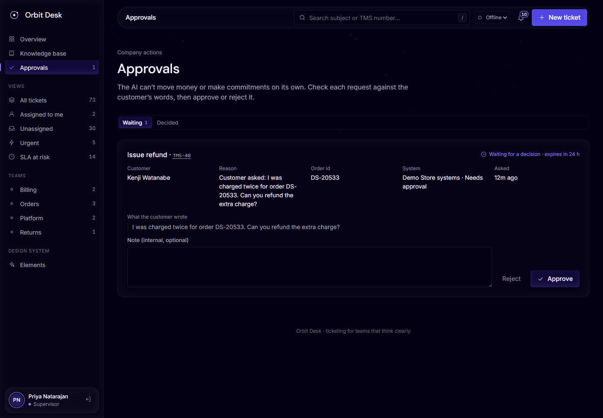

A refund waiting in the drawer, with inline approve:

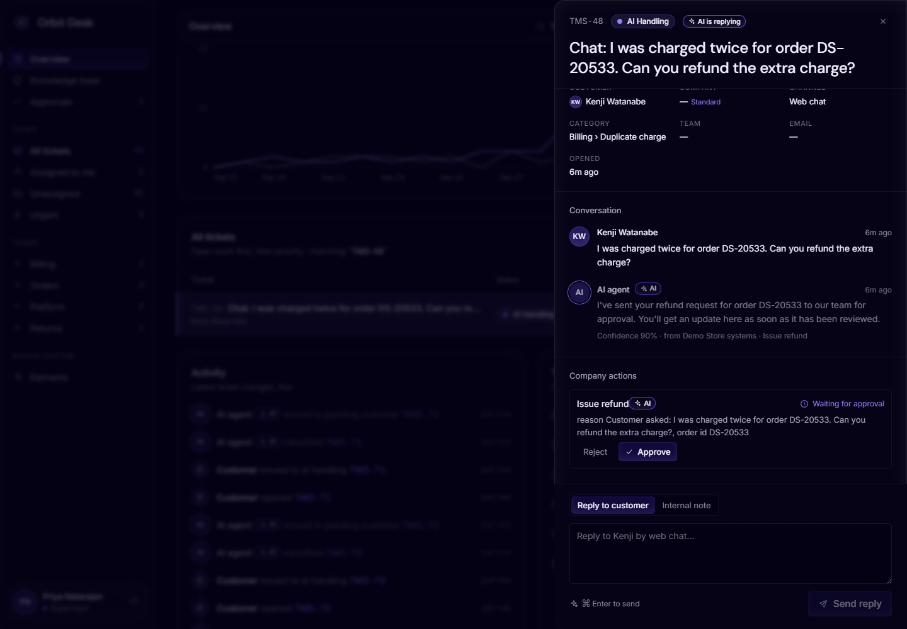

An order lookup, with the reply's source and the call:

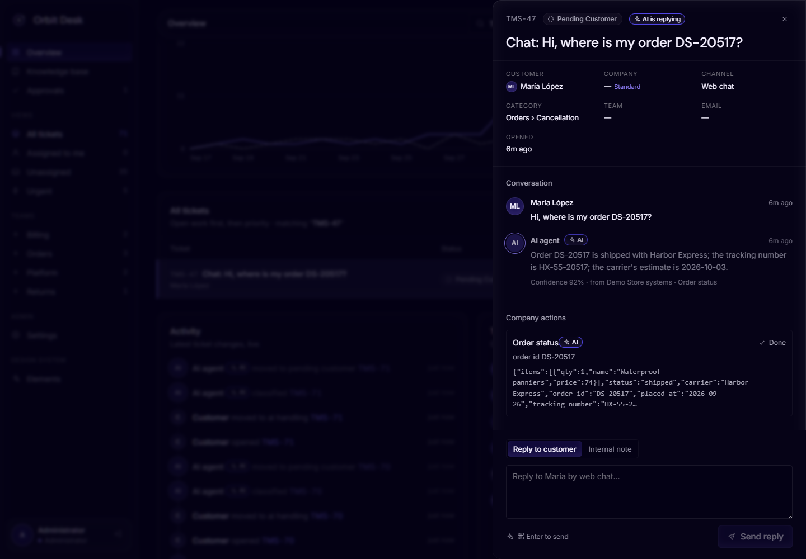

Settings → Tools & MCP:

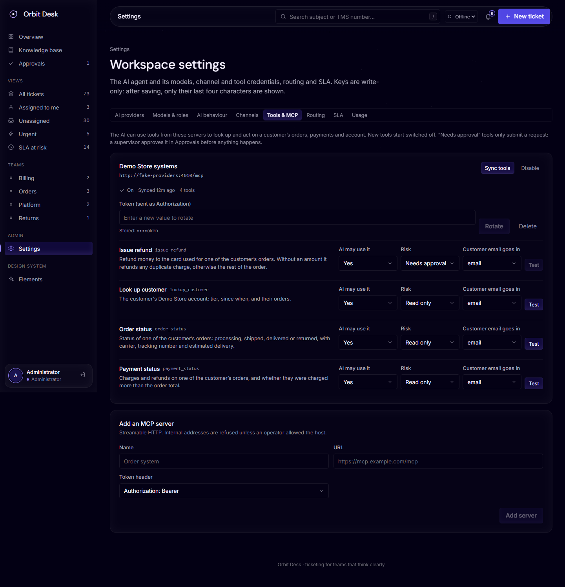

---

## Phase 5b: help-center request form and channel audit

Run on 30 September 2026 against a freshly reset Docker stack (`down -v`, rebuild, `pnpm sample:load`), branch `feat/phase-5b-contact-form`.

**Result: every step of the gate passed.**

| Step                | Result                                                                         |
| ------------------- | ------------------------------------------------------------------------------ |
| `pnpm format:check` | pass                                                                           |
| `pnpm lint`         | pass                                                                           |
| `pnpm build`        | pass                                                                           |
| `pnpm typecheck`    | pass                                                                           |
| `pnpm test`         | 127 passed (api 59, Orbit Desk 43, help center 5, shared 11, fake providers 9) |
| `pnpm test:int`     | 84 passed (9 files)                                                            |
| `pnpm e2e`          | 40 passed; 7 screenshot-only specs skipped as designed                         |
| `pnpm kb:eval`      | recall@5 = 1.00 (18 of 18)                                                     |
| `pnpm ai:eval`      | 6 of 6 golden conversations passed                                             |

The widget phone-width test was added after the full run. It passed on its own, together with the channel and form specs (6 of 6).

One full run had a single failure in `auth.spec.ts`: the browser context closed during teardown, not an assertion. It passed 9 of 9 on repeat and in the next full run, so it is recorded as a flake.

### What was built

- **Help center** at http://localhost:8080/help/ (`apps/help-center`):
  - a "Submit a request" form with name, email, topic, order number, subject, description and up to 3 files of 10 MB each;
  - a "Chat with us" card that opens the existing widget;
  - after sending, the page shows the ticket reference.
- **Channel `web_form`:** the form goes through `InboundService` like every channel.
  - A resubmission returns the same ticket. A honeypot field rejects naive bots.
  - The worker emails an acknowledgement with the reference.
  - Agent and AI replies go out by email, and the customer's email replies thread back onto the same ticket.
  - The AI drafts replies by default, as it does for email.
- **Orbit Desk:**
  - a channel filter on the queue;
  - attachments in the drawer, with download;
  - the ticket's category in the drawer;
  - message paragraphs kept.

### Channel audit: tests and UI per channel

| Channel            | Built?                                                 | Integration tests                                                | Browser tests                                                          | Agent UI (Orbit Desk)                                                             | Customer UI                                     |
| ------------------ | ------------------------------------------------------ | ---------------------------------------------------------------- | ---------------------------------------------------------------------- | --------------------------------------------------------------------------------- | ----------------------------------------------- |
| Web chat (chatbot) | Yes                                                    | `chat.int` (5), `ai.int` (chat answers, drafts, handover)        | `channels.spec`, `ai.spec` (3 chat flows), **new:** widget at 390px    | Channel label and filter, reply by chat, AI marks and drafts                      | Widget labels AI replies; now tested on a phone |
| Email              | Yes                                                    | `email.int`, `ai.int` (email drafts), `web-form.int` (threading) | `channels.spec`, `ai.spec` (draft approved and mailed), `console.spec` | **Fixed:** attachments were not shown in the drawer, and paragraphs ran together  | The customer's own mail client                  |
| Web form           | Yes (this PR)                                          | `web-form.int` (6)                                               | `web-form.spec` (2)                                                    | Channel filter, attachments, category                                             | Help center, desktop and phone                  |
| WhatsApp           | Yes, since Phase 8 (off until a Meta app is connected) | `whatsapp.int` (21 tests), `whatsapp.test` (41 unit tests)       | `whatsapp.spec` (4 tests)                                              | Delivery labels and failure reasons, 24-hour note, template picker, Settings card | `orbit-whatsapp-*`, `orbit-settings-whatsapp`   |
| Voice              | No, Phase 9 (in the browser, as agreed)                | None yet                                                         | Only a "Phone call" ticket logged by an agent (`new-ticket.spec`)      | "Phone call" in New ticket, and the Settings → Channels Sarvam fields             | None yet                                        |

WhatsApp and voice get their adapters, tests and screens in their own phases:

- **WhatsApp:** done in Phase 8 (see the top of this report). There is no simulated Meta API; the tests post signed webhooks to the real route.
- **Voice:** `voice.int` and `voice.spec` with a fake microphone and fake Sarvam, plus a live call card in Orbit Desk.

### New tests

| Where                                     | Tests | Covers                                                                                                                                                                                                                                                                                                                                                                                                             |
| ----------------------------------------- | ----: | ------------------------------------------------------------------------------------------------------------------------------------------------------------------------------------------------------------------------------------------------------------------------------------------------------------------------------------------------------------------------------------------------------------------ |
| `apps/api/test/web-form.int.test.ts`      |     6 | Public form config; a submission with 2 files, category and order number; acknowledgement email (subject, greeting, sent once even when retried, not a first response); customer reply threads onto the same conversation; agent reply by email; no duplicate on resubmit; JSON without files; validation messages, honeypot, unknown topic, too many files; a file over 10 MB is refused and no ticket is created |
| `apps/help-center/src/logic.test.ts`      |     5 | Sizes, file checks, shared-schema validation messages, API error messages, submission ids                                                                                                                                                                                                                                                                                                                          |
| `apps/orbit-desk/.../components.test.tsx` |    +1 | Queue channel filter                                                                                                                                                                                                                                                                                                                                                                                               |
| `e2e/tests/web-form.spec.ts`              |     2 | Customer submits with a file → reference → acknowledgement in Mailpit → agent filters by Web form, downloads the file, replies → email arrives; inline validation and no sideways scroll at 390px                                                                                                                                                                                                                  |
| `e2e/tests/responsive.spec.ts`            |    +1 | Chat widget panel fits a 390px screen                                                                                                                                                                                                                                                                                                                                                                              |

### Bugs found and fixed

1. **Email attachments were invisible to agents.** The API stored and served them, but Orbit Desk never showed them. The drawer now lists them as download chips.
2. **Orbit Desk collapsed line breaks** in every message, so multi-paragraph emails ran together. Bodies now keep their paragraphs.
3. **The drawer never showed a ticket's category**, so a customer's chosen topic sat unseen next to the AI's suggestion. It now has a Category row.
4. **The chat demo page scrolled sideways on phones.** Its code sample overflowed; the block now scrolls on its own. The widget itself fit.
5. **Help-center spacing:** a padding shorthand removed the space under the header. Found in the screenshots and fixed.

### Screenshots

The help center:

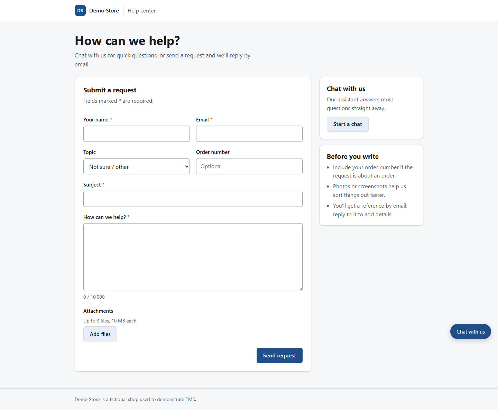

A request ready to send, with a file:

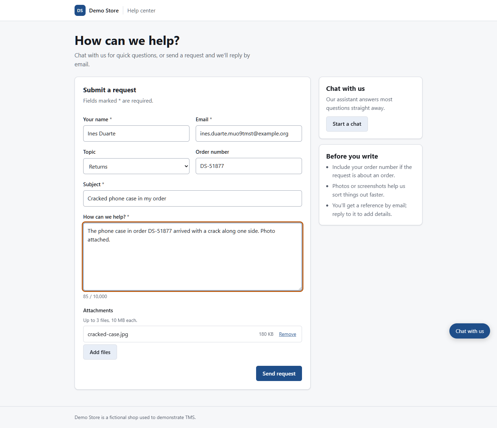

After sending:

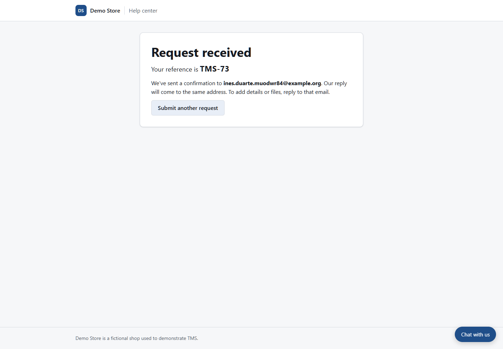

On a phone:

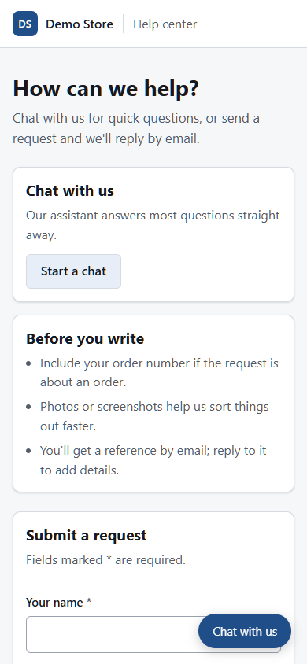

The request in Orbit Desk, with its category, file chip and the acknowledgement:

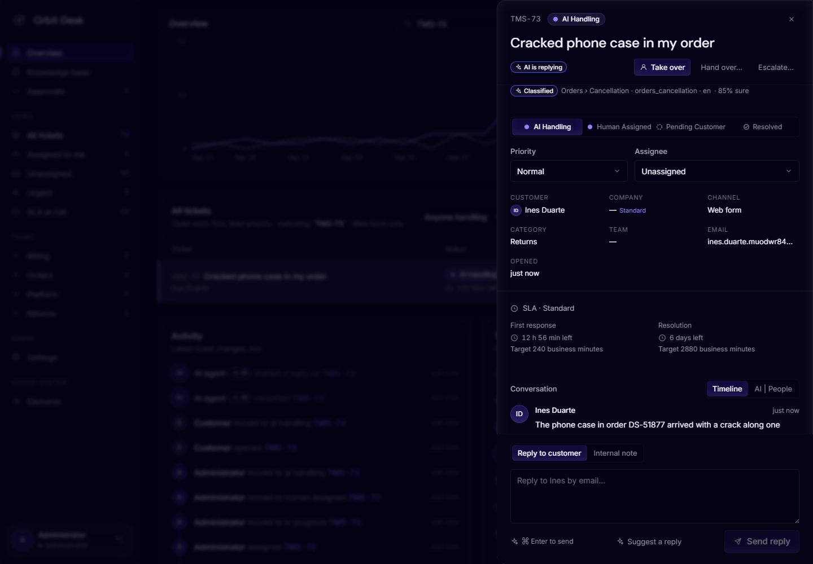

---

## Phase 5: AI agent

Run on 30 September 2026 against a freshly reset Docker stack (`down -v`, rebuild, `pnpm sample:load`), branch `feat/phase-5-ai-agent`.

**Result: every step of the gate passed.**

| Step                | Result                                                 |
| ------------------- | ------------------------------------------------------ |
| `pnpm format:check` | pass                                                   |
| `pnpm lint`         | pass                                                   |
| `pnpm build`        | pass                                                   |
| `pnpm typecheck`    | pass                                                   |
| `pnpm test`         | 121 passed                                             |
| `pnpm test:int`     | 78 passed                                              |
| `pnpm e2e`          | 38 passed; 6 screenshot-only specs skipped as designed |
| `pnpm kb:eval`      | recall@5 = 1.00 (18 of 18)                             |
| `pnpm ai:eval`      | 6 of 6 golden conversations passed                     |

Everything ran against the scripted demo model. It shows the wiring (routing, tools, rules, drafts, handover) works. It does not show answer quality: its confidence comes from word overlap, so it sometimes picks a loosely related passage. Run `pnpm ai:eval` with a real model for that.

### What the AI does with the sample traffic

The loader sends web chats and emails through the real channels, and the AI takes them as they arrive:

- Tom Whitaker (refund timing) and Aarav Kulkarni (the same question in Hindi) are answered from the knowledge base.
- Nina Petrova asks for a person, so the chat is handed over with an AI note.
- Every email gets a draft for an agent to review, because email is drafts-only.
- Questions the knowledge base barely covers are drafted.

### New tests

| Where                                           | Tests | Covers                                                                                                                                                                                                                                                                                             |
| ----------------------------------------------- | ----: | -------------------------------------------------------------------------------------------------------------------------------------------------------------------------------------------------------------------------------------------------------------------------------------------------- |
| `apps/api/src/ai/ai.test.ts`                    |    16 | Send, draft and hand-over thresholds; draft-only channels; factual replies without a source; unsupported promises; repeated failures; handover texts (English and Hindi); prompt tagging and injection stripping; tool argument validation; JSON extraction; language guess; requests for a person |
| `apps/fake-providers/src/agent-script.test.ts`  |     5 | The scripted agent (search then reply, confidence by overlap, handover, Hindi) and classifier                                                                                                                                                                                                      |
| `apps/orbit-desk/src/features/ai/logic.test.ts` |     4 | Confidence, classification text, rule labels, reply source line                                                                                                                                                                                                                                    |
| `apps/api/test/ai.int.test.ts`                  |    18 | See below                                                                                                                                                                                                                                                                                          |
| `e2e/tests/ai.spec.ts`                          |     5 | See below                                                                                                                                                                                                                                                                                          |

`ai.int.test.ts` covers:

- A chat is taken, answered from the knowledge base, delivered, labelled "AI assistant", audited as `ai` and moved to Pending Customer.
- The ticket is classified.
- A follow-up goes back to the AI.
- Unsure answers become drafts that are hidden from the visitor; an edited draft is approved, delivered and audited.
- A person's reply supersedes a waiting draft, and a draft can be discarded.
- Asking for a person hands over, with a note and a customer message.
- A person replying silences the AI.
- A budget running out hands over.
- No usable model leaves the conversation to humans.
- Email is drafted, and the approved draft is emailed.
- AI settings: permissions, validation, "off".
- Six golden conversations.

`ai.spec.ts` covers:

- A widget answer labelled "AI assistant", with the AI mark, confidence, source, classification and AI activity in Orbit Desk.
- An agent edits and sends a draft; the visitor gets the edited text.
- A handover, with the AI note.
- An email draft, approved and delivered to Mailpit.
- An admin tries the agent in Settings; an agent gets 403.

### Bugs found and fixed

1. **A stale AI draft could be sent after a person had already replied** (seen on a sample ticket). A person's reply now discards waiting drafts on that conversation, audited as `superseded`.
2. **Integration tests assumed an empty knowledge base.** The AI tests leave approved documents behind. The KB tests now look for their own document instead of expecting none, or expecting it first.
3. **The drawer's collapsed "AI activity" list was in the DOM and quoted customer text**, which broke an existing E2E text lookup. It now renders only when opened.
4. **Plural words didn't match in the fake agent's scoring** ("card" and "cards"). Simple plural folding fixed it.

### Screenshots

A chat answered by the AI, with its source and the AI activity:

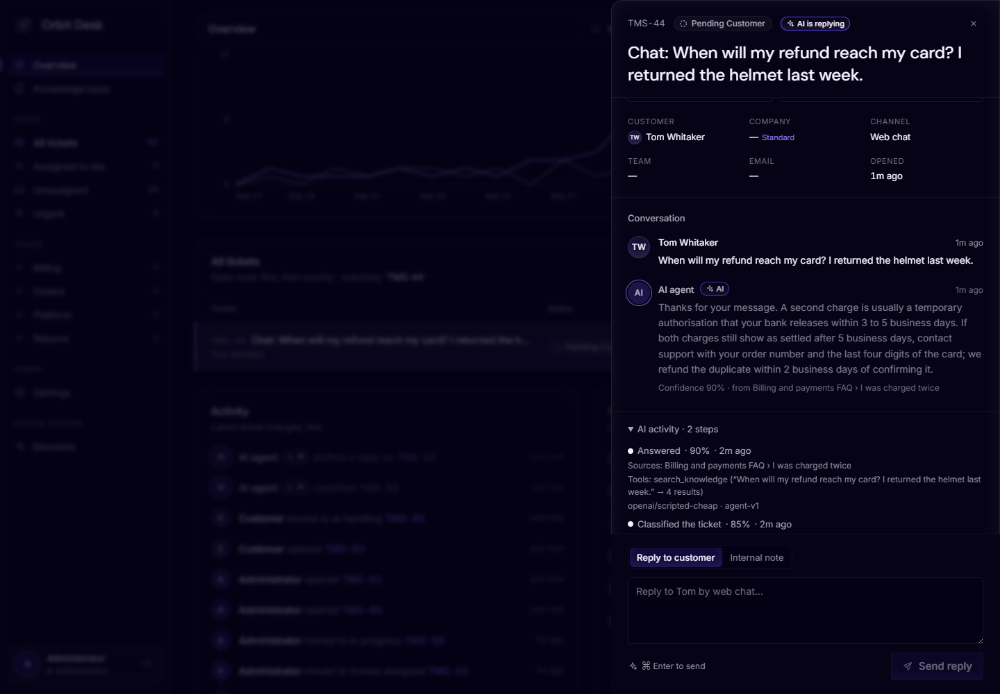

An email draft waiting for review:

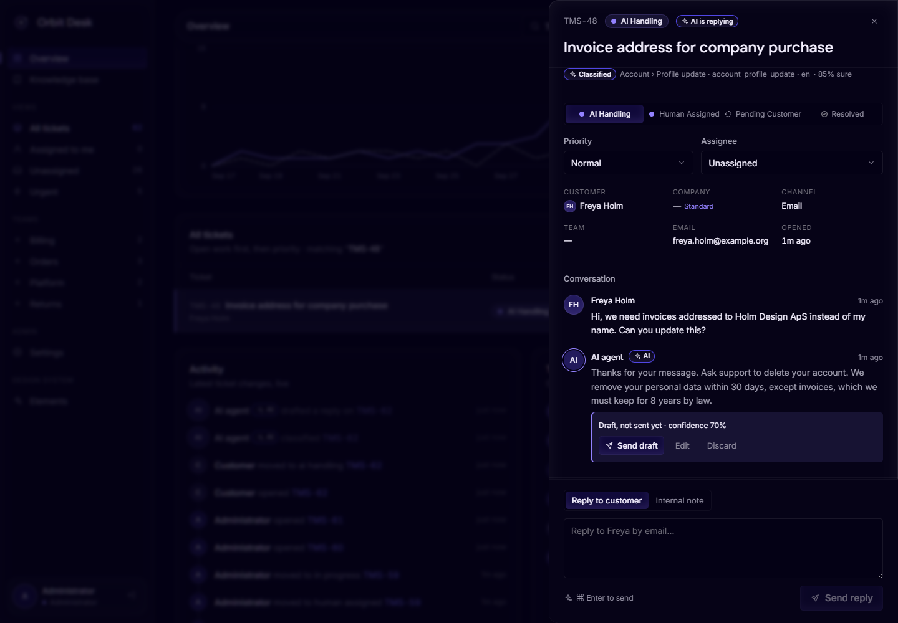

Settings → AI behaviour, with a dry run:

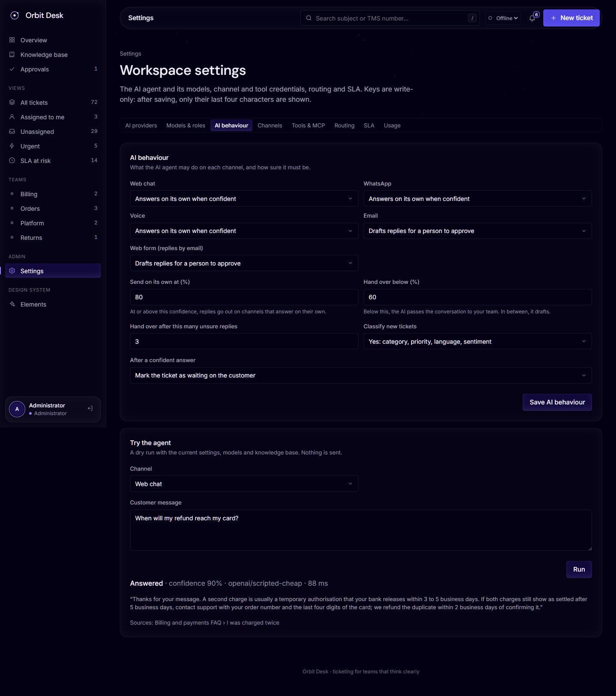

---

## Phase 4: knowledge base

Run on 30 September 2026 against a freshly reset Docker stack (`down -v`, rebuild, `pnpm sample:load`), branch `feat/phase-4-kb`.

**Result: every step of the gate passed.**

| Step                | Result                                                 |
| ------------------- | ------------------------------------------------------ |
| `pnpm format:check` | pass                                                   |
| `pnpm lint`         | pass                                                   |
| `pnpm build`        | pass                                                   |
| `pnpm typecheck`    | pass                                                   |
| `pnpm test`         | 96 passed                                              |
| `pnpm test:int`     | 60 passed                                              |
| `pnpm e2e`          | 33 passed; 5 screenshot-only specs skipped as designed |
| `pnpm kb:eval`      | recall@5 = 1.00 (18 of 18 labelled questions)          |

The check steps ran through `scripts/check-in-docker.sh` as before. `pnpm e2e` ran natively with `CHROMIUM_PATH`.

### New tests

| Where                                           | Tests | Covers                                                                                                                                                                                                                                                                                                                                                                                                                                        |
| ----------------------------------------------- | ----: | --------------------------------------------------------------------------------------------------------------------------------------------------------------------------------------------------------------------------------------------------------------------------------------------------------------------------------------------------------------------------------------------------------------------------------------------- |
| `apps/api/src/kb/kb.test.ts`                    |    13 | Heading trails and chunk sizes with overlap; sentence splitting; file-type detection; HTML headings kept and navigation dropped; PDF text without page markers; private, loopback and metadata addresses refused; rank fusion; section trails without the title; snippets                                                                                                                                                                     |
| `apps/orbit-desk/src/features/kb/logic.test.ts` |     4 | Index state labels, review actions per status, quoting a result with its source, file sizes                                                                                                                                                                                                                                                                                                                                                   |
| `apps/api/test/kb.int.test.ts`                  |     7 | Upload a generated PDF → indexed → not searchable as a draft → approved and found with vector and keyword matches and a file citation. Customer audience sees public documents only; team documents only for members. A new version replaces the old chunks. Keyword fallback without an embedding model. Unsafe URLs, unsupported files and non-managers refused. Audit rows and chunk deletion. Recall@5 ≥ 0.8 on the sample knowledge base |
| `e2e/tests/kb.spec.ts`                          |     5 | Agent search with citations (no drafts, no management); supervisor adds, indexes and approves an FAQ entry; an uploaded Markdown file takes its title from its heading; the ticket drawer inserts a cited answer into the reply; no horizontal scroll at 390px                                                                                                                                                                                |

### Bugs found and fixed

1. **Indexing jobs never ran.** BullMQ rejects job ids containing `:`, and the error only showed in worker logs.
   - **Fix:** ids use `--` as the separator.
   - **Tooling:** `TEST_LOG_LEVEL` now surfaces worker logs in integration tests, and `RUN=...` runs a single test file in the container.
2. **Embeddings came back as 256 numbers instead of 1024.** The `openai` SDK asks for base64 embeddings by default and decoded the float arrays wrongly.
   - **Fix:** the client asks for `encoding_format: 'float'`, and the fake provider handles both formats.
3. **Keyword search found almost nothing for questions.** `websearch_to_tsquery` requires every word.
   - **Fix:** keyword matching ORs the meaningful words and ranks with `ts_rank_cd`.
4. **Uploads without a title were named after the file** ("returns-policy").
   - **Fix:** indexing replaces the file name with the document's first heading or HTML title.
5. **Section trails repeated the document title**, and the top bar said "Overview" on the knowledge base page. Both fixed, and covered by the unit test and the screenshot below.

### Screenshot

Knowledge base search and documents:


---

## Phase 3: LLM platform and Settings keys

Run on 30 September 2026 against a freshly reset Docker stack (`down -v`, rebuild, `pnpm sample:load`), branch `feat/phase-3-llm-settings`.

**Result: every step of the gate passed.**

| Step                | Result                                                 |
| ------------------- | ------------------------------------------------------ |
| `pnpm format:check` | pass                                                   |
| `pnpm lint`         | pass                                                   |
| `pnpm build`        | pass                                                   |
| `pnpm typecheck`    | pass                                                   |
| `pnpm test`         | 79 passed                                              |
| `pnpm test:int`     | 53 passed                                              |
| `pnpm e2e`          | 28 passed; 4 screenshot-only specs skipped as designed |

### How it was run

- The check steps ran through `bash scripts/check-in-docker.sh`: a Node 22 Linux container on the compose network, the same as the CI `check` job.
  - On this Windows host, `@swc/core` refuses to load because its cache folder under `AppData\Local` inherits permissions it treats as unsafe.
- `pnpm e2e` ran natively against the Docker stack, with `CHROMIUM_PATH` pointing at an installed Chromium.
- LiteLLM and `fake-providers` were part of the stack. The integration tests register real providers and models in LiteLLM, pointing at the scripted fake LLM.

### New tests

| Where                                                 | Tests | Covers                                                                                                                                                                                                                                                                                                   |
| ----------------------------------------------------- | ----: | -------------------------------------------------------------------------------------------------------------------------------------------------------------------------------------------------------------------------------------------------------------------------------------------------------- |
| `apps/api/src/llm/llm-router.test.ts`                 |     9 | Cheapest-first ordering by blended price, unknown prices last, cap skipping (including a $0 cap), capability filtering, disabled providers and models, fixed order, allowlists, pinned embeddings, warnings                                                                                              |
| `apps/api/src/settings/secret-crypto.test.ts`         |     7 | AES-GCM round trip, fresh IVs, tamper detection, key-name binding, wrong master key, masking                                                                                                                                                                                                             |
| `apps/fake-providers/src/llm.test.ts`                 |     4 | Scripted replies and deterministic embeddings                                                                                                                                                                                                                                                            |
| `apps/orbit-desk/src/features/settings/logic.test.ts` |     7 | Tabs by permission, money and price formatting, masking, budget parsing, reordering                                                                                                                                                                                                                      |
| `apps/api/test/settings.int.test.ts`                  |    15 | 401/403 for agents and supervisors; secrets encrypted, never echoed or audited in clear, rotated and deleted with audit rows; channel validation and test results; providers through LiteLLM; routing, caps, fallback after a scripted failure, "over budget" error, fixed order, key rotation, deletion |
| `e2e/tests/settings.spec.ts`                          |     5 | The demo provider is masked and tests "Connected"; add a provider and a model in the UI, and cheapest-first routing picks it; a channel secret is stored write-only; hidden from agents and team leads (403); no horizontal scroll at 390px                                                              |

### Bugs found and fixed

1. **Integration run failed on unhandled Redis errors.** All 38 tests passed on `main`, but vitest reported 24 unhandled rejections, so the run exited 1.
   - **Cause:** `RedisIoAdapter.close()` runs once per Socket.IO namespace, and the second call quit connections that were already closed.
   - **Fix:** the adapter quits its clients once, and ignores expected shutdown errors.
2. **Orbit Desk Settings widened the page at 390px by 83px.**
   - **Cause:** visually-hidden table header labels are absolutely positioned. Their containing block was the card, outside the table's scroll box, so they escaped its clipping. A grid item with `min-width: auto` made it worse.
   - **Fix:** the scroll box is `position: relative`, and grid children get `min-width: 0`.
   - **Guard:** the phone-width spec in `settings.spec.ts`.
3. **The sample loader raced LiteLLM on a fresh stack.** LiteLLM runs its own migrations on first start and had no healthcheck.
   - **Fix:** compose has a LiteLLM healthcheck, and the loader waits until `/health/ready` reports LiteLLM up.
4. **Integration tests couldn't reach LiteLLM through Turbo.** Turbo strips undeclared environment variables.
   - **Fix:** `TEST_LITELLM_URL`, `TEST_LITELLM_MASTER_KEY` and `TEST_FAKE_LLM_URL` are declared in `turbo.json`.

### Screenshots

Settings, AI providers:


Settings, models and roles:


---

## Earlier: consolidated main

Run on 30 September 2026, 11:46–11:48 UTC, against a freshly reset Docker stack.

**Result: 113 of 113 tests passed.** That covers 52 unit and component tests, 38 API integration tests and 23 browser end-to-end tests. Three screenshot-only specs were skipped in the main run and run separately to capture the images below.

### What was tested

`main` now combines both earlier Claude branches:

| Branch                         | What it brought                                                                                    |
| ------------------------------ | -------------------------------------------------------------------------------------------------- |
| `claude/pensive-planck-yp2tyi` | Full stack: NestJS API and worker, Postgres/Drizzle, basic console, chat widget, email channel, CI |
| `claude/gifted-clarke-yl2r34`  | Orbit Desk dashboard (`apps/orbit-desk`). It used mock data before and is now wired to the API     |

Changes made on top of the merge:

- **Reports endpoint.** Added `GET /api/v1/reports/overview`, which feeds the dashboard's tiles, chart, queue health, team load and activity feed.
- **Orbit Desk on real data.** It now signs in, reads and writes real data, and updates live over the `/agent` socket.
- **Sample data loader.** `pnpm sample:load` fills the stack with fictional records.
- **E2E suite and CI.** Added a Playwright suite in `e2e/` and an `e2e` job in CI.

### Environment

| Piece          | Detail                                                                                                        |
| -------------- | ------------------------------------------------------------------------------------------------------------- |
| Stack          | `infra/docker-compose.yml`, profile `app`: api, worker, migrate, web (:8080), orbit-desk (:8081)              |
| Infrastructure | Postgres 16 (pgvector image), Redis 7, SeaweedFS (S3), GreenMail (support mailbox), Mailpit (outbound mail)   |
| Images         | Built from the root `Dockerfile`, with base images pulled via `mirror.gcr.io` because Docker Hub returned 429 |
| Browser        | Chromium through Playwright 1.56.1, 1440×1000 viewport (390×844 for the phone test)                           |
| Runtime        | Node 22, pnpm 9.15                                                                                            |
| Not started    | LiteLLM. Its phase (Phase 3) hasn't begun, so `/health/ready` reports it as `down` as expected                |

### Sample data (fictional, written for this run)

The loader lives in `scripts/sample-data/`. Every person and company is invented, and all email domains use the reserved `example.*` TLDs.

| Data         | Contents                                                                                                                                                                   |
| ------------ | -------------------------------------------------------------------------------------------------------------------------------------------------------------------------- |
| Teams        | 4: Orders, Billing, Returns, Platform                                                                                                                                      |
| Users        | 7: one team lead, one supervisor, five agents. Password `Sample-Passw0rd!`                                                                                                 |
| Customers    | 25: 13 standard, 8 business, 3 VIP, 1 internal. Company stored in attributes; 4 have WhatsApp identities, some have phones                                                 |
| Tickets      | 40 scripted. **Status:** 8 new, 1 AI handling, 2 human assigned, 6 in progress, 4 pending, 14 resolved, 5 closed                                                           |
|              | **Priority:** 4 urgent, 6 high, 20 normal, 10 low. **Channel:** 25 email, 7 web chat, 4 WhatsApp, 3 phone, 1 agent                                                         |
| Activity     | 6 internal notes and 6 agent email replies (delivered to Mailpit)                                                                                                          |
| Live traffic | 3 web chats sent through the widget socket and 3 customer emails sent over SMTP to the support mailbox. Each became a ticket, and an agent answered one chat and one email |
| History      | Ticket timestamps spread over 14 days, so the chart and medians have shape                                                                                                 |

The loader finished in about 20 seconds. A second run correctly stopped with the message "already loaded".

Dashboard figures after the full test run, which adds its own tickets on top of the sample data:

- **Counts:** 36 open tickets, 19 unassigned, 10 resolved in 7 days.
- **Medians:** 5h 30m to resolution, 40m to first response.
- **Open tickets by channel:** 18 email, 10 web chat, 3 WhatsApp, 3 phone, 2 agent.
- **Mailpit:** 10 outgoing messages.

### Results

#### Unit and component tests (`pnpm test`): 52 passed

| Package           | Tests | Covers                                                                                                                                                                                  |
| ----------------- | ----: | --------------------------------------------------------------------------------------------------------------------------------------------------------------------------------------- |
| `@tms/shared`     |    11 | Workflow defaults, ticket numbers, identity normalisation, roles, report helpers (`median`, `lastDays`)                                                                                 |
| `@tms/api`        |    14 | Email parsing and threading, workflow rules                                                                                                                                             |
| `@tms/orbit-desk` |    27 | API adapters, status glyphs, allowed transitions, thread merging, queue ordering, triage, KPIs, activity text, chart scale, and components: queue table, new ticket form, ticket drawer |

#### API integration tests (`pnpm test:int`, real Postgres, Redis, S3 and GreenMail): 38 passed

| File                       | Tests | Covers                                                                                                                |
| -------------------------- | ----: | --------------------------------------------------------------------------------------------------------------------- |
| `api.int.test.ts`          |    23 | Health, auth, RBAC, customers, tickets, workflow, notes, history, audit                                               |
| `chat.int.test.ts`         |     5 | Widget sessions, visitor to ticket, live agent reply, rate limit                                                      |
| `email.int.test.ts`        |     3 | Email to ticket, threaded replies both ways, reopen on answer, auto-reply filtering                                   |
| `outbox-relay.int.test.ts` |     4 | Outbox relay and delivery                                                                                             |
| `reports.int.test.ts`      |     3 | New endpoint: permission gate (401/403/200), exact deltas after create/assign/resolve, customer fields on ticket rows |

#### End-to-end tests (`pnpm e2e`, Playwright against the Docker stack): 23 passed

Every test also fails if the browser logs an unexpected console error.

| #   | Area                | Test                                                                                             | Result |
| --- | ------------------- | ------------------------------------------------------------------------------------------------ | ------ |
| 1   | Auth: Orbit Desk    | Wrong password shows "Email or password is incorrect"                                            | Pass   |
| 2   | Auth: Orbit Desk    | Sign in, session survives reload, sign out                                                       | Pass   |
| 3   | Auth: basic console | Wrong password rejected, then sign in and out                                                    | Pass   |
| 4   | Web chat            | Visitor message in the widget becomes a ticket without a reload; agent reply reaches the visitor | Pass   |
| 5   | Email               | Customer email over SMTP becomes a ticket; drawer reply arrives in Mailpit tagged `[TMS-n]`      | Pass   |
| 6   | Basic console       | List, search and open a ticket                                                                   | Pass   |
| 7   | Basic console       | Reply on an email conversation                                                                   | Pass   |
| 8   | Basic console       | Customer search and customer page                                                                | Pass   |
| 9   | Dashboard           | KPI tiles, queue health, team load and activity match `/reports/overview`                        | Pass   |
| 10  | Dashboard           | Sidebar view counts and rows match API queries (all, unassigned, urgent)                         | Pass   |
| 11  | Dashboard           | "Assigned to me" as a team lead shows only that user's tickets                                   | Pass   |
| 12  | Dashboard           | Search by subject and by `TMS-n`, empty state and clear, status tabs                             | Pass   |
| 13  | Dashboard           | Clicking an activity entry opens that ticket                                                     | Pass   |
| 14  | Dashboard           | A ticket created through the API appears live                                                    | Pass   |
| 15  | Ticket drawer       | Details, and only the workflow-allowed transitions are offered                                   | Pass   |
| 16  | Ticket drawer       | Note, status, priority and assignee changes; API state and queue row agree                       | Pass   |
| 17  | Ticket drawer       | Reply is delivered (pending, then sent) and emailed to the customer                              | Pass   |
| 18  | New ticket          | Existing customer found by search; saved with priority, channel and tags                         | Pass   |
| 19  | New ticket          | New customer created inline                                                                      | Pass   |
| 20  | New ticket          | API validation error shown for an invalid email                                                  | Pass   |
| 21  | RBAC                | Agent sees the queue but no reports, gets 403 from `/reports/overview`, and can't reassign       | Pass   |
| 22  | RBAC                | API refuses assignment by an agent (403)                                                         | Pass   |
| 23  | Phone width (390px) | No horizontal scroll on first paint or after load; menu drawer opens; drawer fits the screen     | Pass   |

### Bugs found and fixed while testing live

1. **Orbit Desk: horizontal scroll on phones while the dashboard loads.**
   - **Cause:** the volume chart rendered 640px wide until its ResizeObserver fired, adding 286px of horizontal scroll at 390px.
   - **Origin:** the bug was already on the Orbit Desk branch; mock data loaded instantly and hid it.
   - **Fix:** the chart is now measured before first paint.
   - **Guard:** E2E test 23.
2. **Orbit Desk: long subjects widened the queue table**, which pushed the Channel column out of view at 1440px.
   - **Fix:** the ticket cell now ellipsizes.
   - **How it was found:** only real, longer subjects exposed it.
3. **Merge: two Vite versions broke the API typecheck.** Orbit Desk's Vite 8 / Vitest 5 toolchain changed how dependencies resolved, which broke the API typecheck.
   - **Fix:** Orbit Desk now uses the same Vite 6 / Vitest 3 as the rest of the repo.
4. **Docker builds failed on the Docker Hub rate limit (HTTP 429).**
   - **Fix:** the `Dockerfile` now takes `NODE_IMAGE` and `NGINX_IMAGE` build args, so a mirror can be used. This is documented in the README.

A few first-run failures came from the tests themselves: the wrong error wording, a duplicate text match and a float rounding. Those tests were corrected, and the app was not changed for them.

### Known limits

- **No SLA or CSAT figures.** The backend has no data for them until the SLA phase, so Orbit Desk no longer shows invented numbers. The "SLA at risk" view is gone for the same reason.
- **Day boundaries are UTC.** The volume chart groups days in UTC.
- **Queue lists are capped.** A view shows at most 200 rows, the API page limit, and says so when capped.
- **Tests leave data behind.** The E2E tests create their own tickets and can be re-run on the same data, but each run adds records. Reset with `docker compose -f infra/docker-compose.yml --profile app down -v`.

### Reproduce

```bash
pnpm install
pnpm docker:up                     # or build with the mirror args if Docker Hub rate-limits you
pnpm sample:load
pnpm test                          # unit and component tests
docker compose -f infra/docker-compose.yml exec postgres createdb -U tms tms_test
pnpm test:int                      # integration tests
pnpm --filter @tms/e2e exec playwright install chromium
pnpm e2e                           # E2E; HTML report in e2e/playwright-report
SCREENSHOTS=1 pnpm --filter @tms/e2e e2e tests/screenshots.spec.ts   # refresh the images below
```

### Screenshots

Orbit Desk dashboard on sample data:


Queue:


Ticket drawer with notes and a delivered email reply:


New ticket, with customer search:


Phone width:


Basic console ticket page:


Chat widget on the demo store page:


Outgoing replies in Mailpit:


